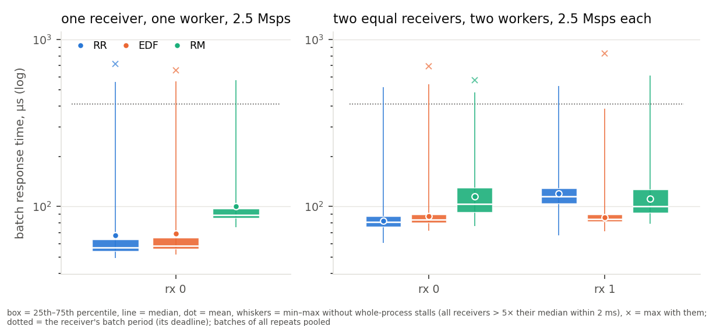
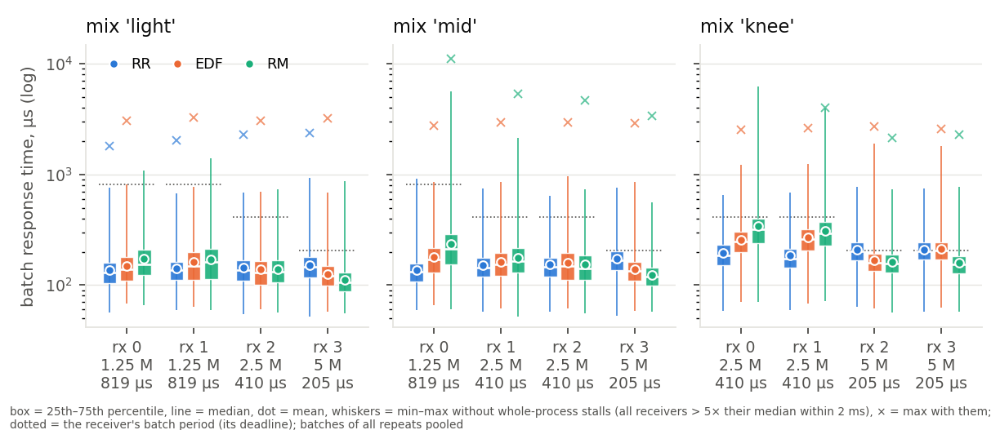
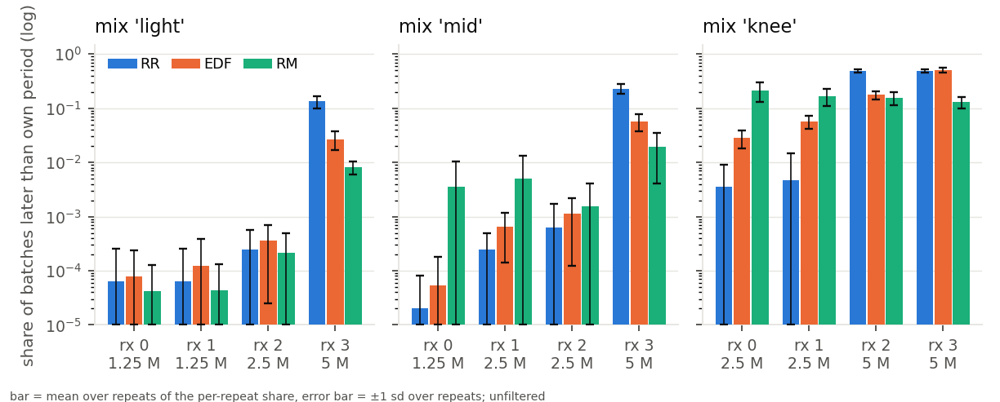
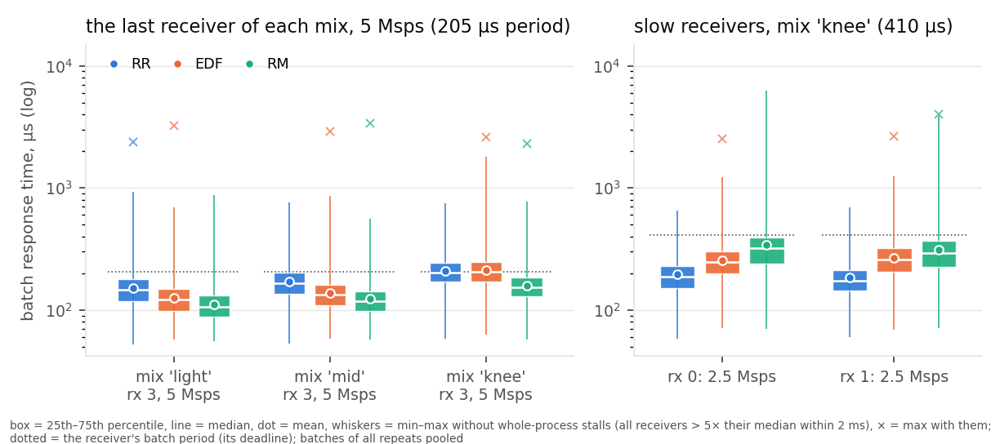
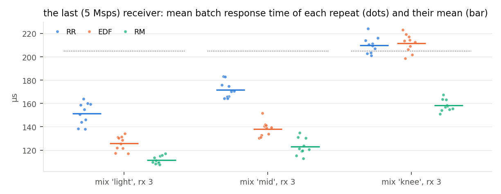

# Which policy for which workload: RR, EDF and RM on the 802.11p receiver

Full sweep, 2026-09-18/19: the five workloads of the preliminary matrix
(`../prelim/REPORT.md`) at 10 repeats × 30 s per cell, 150 runs in 5 h 50 min,
none saturated (every run kept real time within 1.1–1.8 %). Driver
`scripts/rt-prelim4 --repeats 10`; figures, tables and every number below from
`scripts/rt-full-figs.py` (`numbers.json`, `TABLE.md`). The three policies are
GNU Radio 4's round robin (RR), earliest deadline first (EDF) and rate monotonic
(RM), selected as a template argument; no scheduler code was changed, and every
run uses `process_stream_to_message_ratio` 4096 for every policy (at the
default of 16 EDF pays a 45 µs re-sync every 16 passes, 29 % of a worker;
`../multirate/REPORT.md` §3).

**The three findings, stated up front.**

1. **Round robin is the better policy for a simple workload**, one where EDF has
   nothing to decide: with one receiver every job carries the same relative
   deadline, EDF's order degenerates to release order (FIFO), and what remains
   of EDF is its bookkeeping.
2. **EDF is the better policy where the receivers differ and something must be
   chosen**: when round robin cannot prioritise (its sweep order is the graph
   order, blind to rates and deadlines) and when rate monotonic would starve the
   slow receivers to serve the fast ones.
3. **Rate monotonic is the better policy for the fastest receiver**: a static
   "highest rate first" order serves the tightest deadline with no release
   detection at all, and beats EDF on that receiver in every mix.

## 1. Setup

**Platform.** A KVM/QEMU guest (8 vCPUs, no frequency control), Linux 7.0,
GNU Radio 4 at the `ieee80211-rx-latency` branch of the fork, default kernel
scheduling, no isolation, no real-time priorities.

**Workload.** The IEEE 802.11p receiver of `gr-ieee802-11` ported block for
block (18 blocks per receiver), replaying back-to-back 300-byte QPSK 1/2 frames
through a throttle at the receiver's rate, fixed batches of *N* = 1024 samples,
every block with an explicit relative deadline of one batch period *N*/rate
(its implicit deadline), every trace category live. Five workloads:

| workload | receivers (Msps, graph order) | workers | what it tests |
|---|---|---|---|
| simple1 | 2.5 | 1 | nothing to prioritise |
| simple2 | 2.5, 2.5 | 2 | equal deadlines across receivers |
| light | 1.25, 1.25, 2.5, 5 | 4 | different rates, ample capacity |
| mid | 1.25, 2.5, 2.5, 5 | 4 | different rates, more load |
| knee | 2.5, 2.5, 5, 5 | 4 | different rates, near the knee |

In the mixes the fastest receiver is last in graph order (round robin serves
it last), construction order is rotated by one slot per receiver so the heavy
blocks spread over the workers, and RM gets the true per-receiver periods
(fastest first). In `simple2` the construction order is rotated too.

**Metric.** Batch response time: from a batch's nominal arrival at the
throttle to its consumption by the `sync_short` gate, from stream positions in
the trace; and the share of a receiver's batches later than its own period.
The batches of the ten repeats are pooled per cell (46 000 to 500 000 batches
per cell); the box plots show the 25th–75th percentile, the median, the mean
and min–max. The analysis window of a run is what the rings retained: the last
3.7–4.3 s of an RR or RM run, 7–11 s of an EDF run (an idle RR or RM worker
emits records faster). The late-share bars are means over repeats with ±1 sd
error bars, so run-to-run variation is visible.

**Outlier filter.** A batch is excluded as a *whole-process stall* when its
response time exceeds 5× the median of its cell **and** every other receiver of
the same run has such a batch released within 2 ms of it: the process as a
whole stopped, which on this host is the guest being descheduled, not the
policy. One-receiver runs, which have no second receiver to coincide with,
exclude batches above 10× the median instead. The filter removed 554 of
7 637 415 batches (0.007 %), at most 0.041 % of a cell, in clusters of about
2–3 ms, 1 to 10 episodes per cell over the ten repeats; the plots draw the raw
maximum as a cross so the cut is visible, and `TABLE.md` lists every count. A
policy effect that hits one receiver alone is never cut: RM's 6.2 ms and
3.9 ms maxima on the slow receivers of the knee mix (§3) are kept.

## 2. Finding 1 — round robin for the simple workload

| workload | receiver | RR mean / median / 75 % / max µs | EDF | RM |
|---|---|---|---|---|
| simple1 | rx 0 | 67 / 57 / 64 / 557 | 69 / 58 / 65 / 560 | 101 / 89 / 97 / 570 |
| simple2 | rx 0 | 82 / 81 / 87 / 518 | 87 / 83 / 90 / 541 | 115 / 103 / 130 / 482 |
| simple2 | rx 1 | 119 / 115 / 128 / 525 | 86 / 84 / 90 / 385 | 111 / 100 / 126 / 608 |

**One receiver.** With one receiver every job has the same relative deadline
and EDF's order is release order: it is round robin with bookkeeping. Over
100 000 (RR) and 273 000 (EDF) batches the two policies are 1.6 µs of mean
apart (67 against 69), one µs of median and of 75th percentile, and 3 µs of
maximum. What EDF pays for is measured elsewhere: per invocation its
bookkeeping equals RR's on one chain and is 40 % more on three (M2,
`../micro/MICRO.md`: 958 vs 958 ns, 1104 vs 796 ns at *N* = 1024), and per
pass its release scan takes 14–28 % of a worker's time that RR spends probing
instead (M6). RM is 33 µs slower because with one receiver its static order is
the tie-break among equal periods, not a rate order. Nothing is late under any
policy: the 410 µs period is never exceeded except in the stall clusters.

**Two equal receivers.** The same relative deadlines again, so EDF is FIFO
across the two receivers, and the figure shows what that buys and costs: EDF
serves both receivers alike (87 and 86 µs), round robin serves the first in
82 µs and the second in 119 µs, because its sweep order is the graph order and
the second receiver's blocks come after the first's on every worker. RR wins
the first receiver by 5 µs and loses the second by 33. So the simple workload
where RR wins is the one receiver, or receivers whose order in the graph does
not matter; as soon as two equal receivers are compared with each other, EDF's
FIFO is fairer and cheaper in total (86 against an average of 101 µs) than
RR's fixed order. RM serves both in 111–115 µs. Nothing is late under any
policy.

## 3. Finding 2 — EDF where receivers differ and something must be chosen

Batch response time mean / 75th percentile / max µs, and the share of batches
later than the receiver's own period (mean ± sd over the ten repeats):

| mix | receiver (Msps, period µs) | RR | EDF | RM |
|---|---|---|---|---|
| light | rx 3 (5, 205) | 151 / 179 / 926 (13.3 ± 3.6 %) | **126 / 149 / 689 (2.7 ± 1.0 %)** | 112 / 131 / 876 (0.8 ± 0.2 %) |
| light | rx 2 (2.5, 410) | 143 / 166 / 681 (0.0 %) | 138 / 165 / 699 (0.0 %) | 140 / 167 / 734 (0.0 %) |
| light | rx 0, rx 1 (1.25, 819) | 136, 141 | 149, 161 | 173, 169 |
| mid | rx 3 (5, 205) | 172 / 201 / 756 (23.0 ± 4.5 %) | **138 / 161 / 860 (5.8 ± 2.0 %)** | 123 / 143 / 562 (1.9 ± 1.5 %) |
| mid | rx 1, rx 2 (2.5, 410) | 151, 153 (0.0, 0.1 %) | 162, 158 (0.1, 0.1 %) | 177, 154 (0.5, 0.2 %) |
| mid | rx 0 (1.25, 819) | 137 | 180 | 235 (max 5.6 ms) |
| knee | rx 2 (5, 205) | 209 / 244 / 774 (48.6 ± 3.7 %) | **167 / 191 / 1900 (17.5 ± 2.8 %)** | 162 / 188 / 731 (15.4 ± 4.0 %) |
| knee | rx 3 (5, 205) | 210 / 243 / 743 (48.8 ± 4.1 %) | 212 / 245 / 1806 (50.1 ± 5.5 %) | 158 / 183 / 767 (13.1 ± 3.2 %) |
| knee | rx 0, rx 1 (2.5, 410) | 195, 184 (0.4, 0.5 %) | **254, 268 (2.8 ± 1.0, 5.8 ± 1.5 %)** | 343, 311 (21.5 ± 8.6, 16.9 ± 6.0 %) |

**Where round robin cannot prioritise.** RR's sweep is the graph order: the
5 Msps receiver, last in the graph, is served last on every worker whatever
its deadline says, and it is the only receiver that is ever late under RR:
13.3 %, 23.0 % and 48.6–48.8 % of its batches miss its 205 µs period in the
three mixes, while the slow receivers are late in 0.0–0.5 % of theirs. EDF
reads the deadlines and moves the lateness to where it belongs: the 5 Msps
receiver's late share falls by a factor of 4.9 (light), 4.0 (mid) and 2.8
(knee, rx 2), its mean by 26, 34 and 43 µs, its 75th percentile by 30, 40 and
53 µs; the receivers with the 819 µs deadlines pay 14–43 µs of mean that they
can afford and stay at 0.0 % late. At the knee, where the graph is near the
capacity of four workers, RR has both 5 Msps receivers late half the time; EDF
holds one of them at 17.5 % and leaves the other where RR had it (50.1 %),
because with two receivers of the same rate and deadline EDF has nothing to
choose between them and the graph order decides again.

**Where rate monotonic would starve the slow receivers.** RM's static order
serves the 5 Msps receivers first always. In the light and mid mixes that
costs the slow receivers up to 98 µs of mean (mid rx 0: 235 µs against RR's
137, with a 5.6 ms maximum) and nothing is late. At the knee it starves them:
21.5 ± 8.6 % and 16.9 ± 6.0 % of the 2.5 Msps receivers' batches miss their
410 µs period under RM, with maxima of 6.2 and 3.9 ms, against 2.8 ± 1.0 % and
5.8 ± 1.5 % under EDF (maxima 1.2 and 1.3 ms) and 0.4–0.5 % under RR. EDF's
slow receivers are 89 and 43 µs faster in the mean than RM's, and it holds one
of the two fast receivers where RM does (167 against 162 µs, 17.5 against
15.4 % late). So under load EDF is the policy that keeps every receiver's
lateness bounded by its own deadline as far as the graph allows, where RR
cannot see the deadlines and RM sacrifices the slow receivers to the fast
ones. The error bars say the same: RM's late share on the slow receivers
varies by ±6–9 points from repeat to repeat, EDF's by ±1–1.5.

**EDF's own accounting** agrees: in its 50 runs it missed 0 to 60 of its
per-job pipeline deadlines per run, out of hundreds of thousands of releases
each.

## 4. Finding 3 — rate monotonic for the fastest receiver

| mix | last receiver (5 Msps): RR | EDF | RM |
|---|---|---|---|
| light | 151 µs, 13.3 % late | 126 µs, 2.7 % | **112 µs, 0.8 %** |
| mid | 172 µs, 23.0 % | 138 µs, 5.8 % | **123 µs, 1.9 %** |
| knee | 210 µs, 48.8 % | 212 µs, 50.1 % | **158 µs, 13.1 %** |

On the last, fastest receiver of every mix RM is the best policy: 14, 15 and
53 µs better than EDF in the mean and 3 to 4 times fewer late batches
(the per-repeat means, second figure, are 3–9 µs apart within a policy, so
these differences are many times the run-to-run variation). A static
"highest rate first" order needs no release detection: the moment a worker
looks for work it takes the 5 Msps receiver's block if it has input, while
EDF admits a time-driven source only at its per-pass release scan and a
cross-worker successor only at the next pass of the other worker, so a tight
job is seen tens of µs later than RM acts on it. At the knee RM is also the
only policy that serves *both* 5 Msps receivers under their period most of
the time (13.1 % and 15.4 % late). The price is the right-hand panel: RM's
slow receivers at the knee are the worst of any policy (343 and 311 µs mean,
17–22 % late, 6.2 ms maximum). RM is the policy for a system whose only
requirement is the fastest receiver's latency and whose slow receivers may
wait.

## 5. Threats to validity

- **Virtual machine.** All timings are from a KVM/QEMU guest with 8 vCPUs and
  no frequency control. The whole-process stalls the filter removes (0.007 % of
  batches, clusters of about 2–3 ms that hit every receiver at once) are the
  visible part of that; the maxima that remain still carry host noise, the
  boxes and means do not.
- **Windows.** Statistics are over the batches inside the span the rings
  retained at the end of each 30 s run: 3.7–4.3 s per RR or RM run, 7–11 s
  per EDF run, pooled over ten repeats. Every window is the steady state of a
  run that kept real time; the RR and RM samples are about half of EDF's.
- **Ratio 4096 for all.** At the scheduler's default house-keeping ratio of 16
  EDF loses every one of these comparisons (`../multirate/REPORT.md` §2.1, §3);
  the ratio was raised for all three policies and does not change RR or RM.
- **The instrument.** Every category traced; the trace costs 1–2 % of run time
  (M5) and idle RR/RM workers emit records fastest, hence their shorter
  windows.
- **Partitioned, non-preemptive.** Blocks are dealt to workers by index and a
  running block is never interrupted; a policy orders one worker's share. The
  construction order was rotated so that the receivers' heavy blocks spread
  over the workers.
- **Deadlines are per block and implicit.** "Late" means the end-to-end batch
  path exceeded the receiver's own period; EDF was given per-block deadlines of
  that same length and met them.
- **The knee mix is near overload.** The measured demand of the busiest worker
  is 0.56–0.57 there; the knee columns compare the policies under near-overload,
  where the repeat-to-repeat spread is widest (RM's late shares ±6–9 points).

## 6. Files

- `full_simple`, `full_mixes`, `full_mix_light|mid|knee`, `full_late`,
  `full_fast_slow`, `full_repeats` (PDF + PNG), `numbers.json`, `TABLE.md` —
  this directory.
- Runs: `data/rt_300_300_102934_QPSK_1_2_s1/runs4/full-x86-8core/<workload>_<policy>_rep<k>/`
  (`batch_rt.json`, `batch_rt.csv`, `latency_summary.json`, `trace_meta.json`;
  not tracked), `index.json`.
- Reproduce (about six hours): `./scripts/rt-prelim4 --out-dir <runs dir>
  --repeats 10 --run-s 30 --ring 33554432 --warmup 5 --window 20`, then
  `./scripts/rt-full-figs.py <runs dir> --out-dir results/sweep-<name>/full`.
