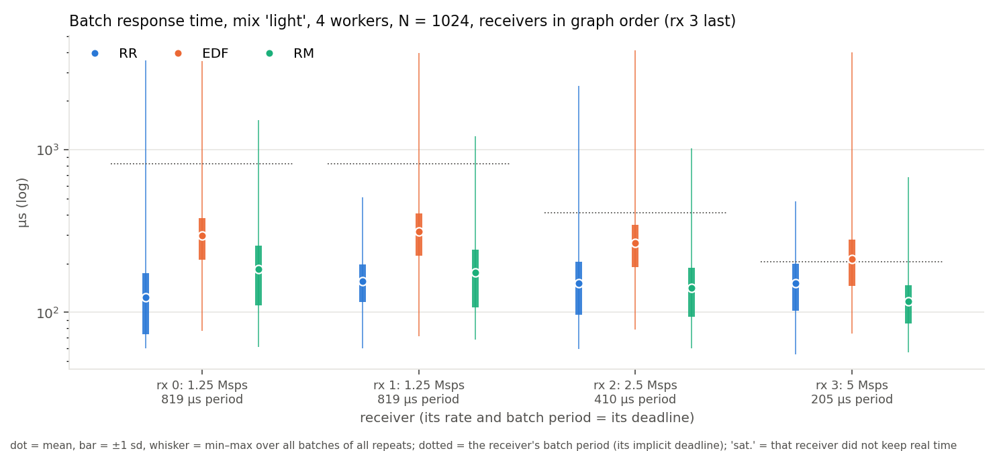
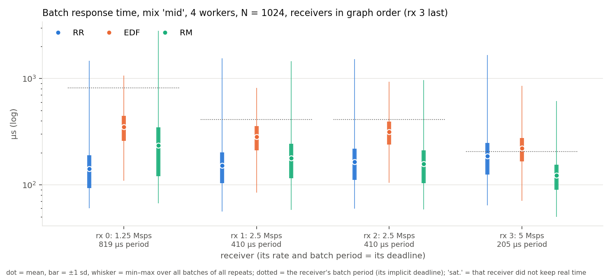
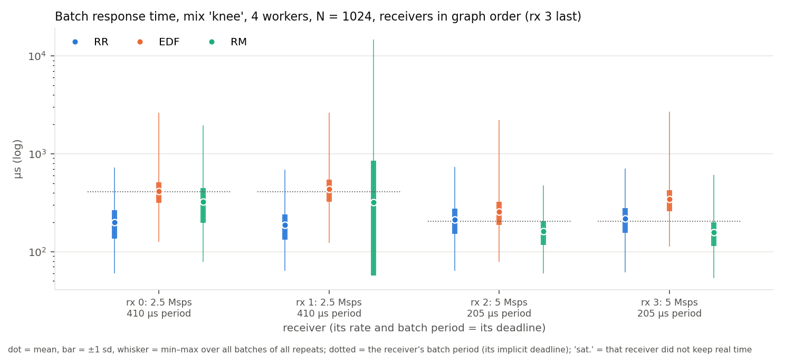
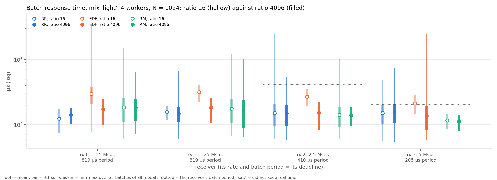
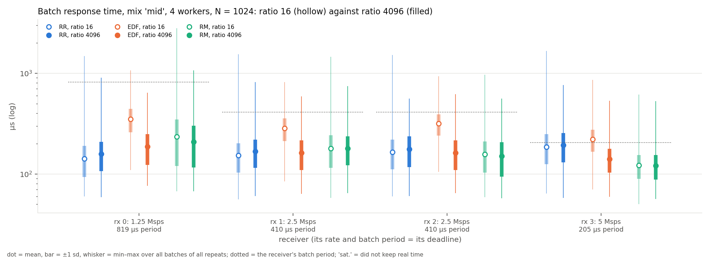
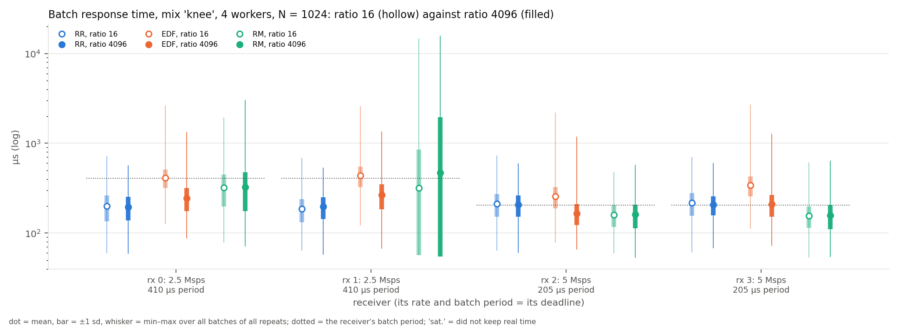
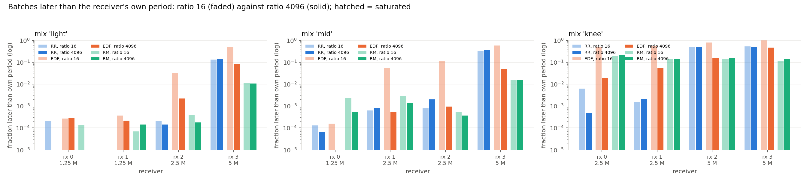

# Multi-rate receivers on four workers: RR, EDF and RM, and the house-keeping re-sync

Experiment report for the four-worker micro experiment (2026-09-18). Figures
and every number in this document come from `scripts/rt-multirate-figs.py`
(`numbers.json` in this directory and in `../multirate-r4096/`),
`scripts/rt-multirate-compare.py` (`compare/TABLE.md`, `compare/compare.json`)
and `scripts/rt-microbench4 --only M6` (`../micro/micro.json`, M6 section of
`../micro/MICRO.md`). The runs are `rt-sweep4 --multirate` with the profiles
`x86-8core.json` (the scheduler's default `process_stream_to_message_ratio`
of 16) and `x86-8core-r4096.json` (4096); no scheduler code was changed.

## 1. Question and setup

**Question.** With four workers and four receivers of different rates, each
with its own deadline, can EDF's deadline ordering be seen to beat round
robin's list order and rate monotonic's period order on the batch response
time of the receiver that matters most, the fastest one?

**Platform.** As in `../paper/RESULTS.md` §1: a KVM/QEMU guest with 8 vCPUs
and no frequency control, GNU Radio 4 at the `ieee80211-rx-latency` branch
of the fork, default kernel scheduling, no isolation, no real-time
priorities.

**Workload.** Four instances of the 802.11p receiver (18 blocks each, 72
blocks) in one process on four workers, fixed batches of *N* = 1024
samples, every trace category live, 30 s of replay per run, three repeats
per configuration. The receivers differ only in rate; each one's batch
period *N*/rate is its implicit relative deadline on every pipeline block
(source and throttle keep their tiny deadlines), so a faster receiver has a
tighter deadline, as a station serving several 802.11p channels at
different bandwidths would. Three mixes, receivers listed in graph order:

| mix | rx 0 | rx 1 | rx 2 | rx 3 | total Msps |
|---|---|---|---|---|---|
| light | 1.25 | 1.25 | 2.5 | 5 | 10 |
| mid | 1.25 | 2.5 | 2.5 | 5 | 11.25 |
| knee | 2.5 | 2.5 | 5 | 5 | 15 |

The fastest receiver is *last* in graph order, where round robin's fixed
sweep serves it last, so that an RR win could not be a list-order artefact.
Receiver *k*'s construction order is rotated by *k* slots (`--rotate 1`), so
the heavy blocks (`sync_short`, `sync_long`, equaliser) of the four
receivers fall on different workers instead of all on the same two; the
receiver itself is unchanged. RM gets the true per-receiver periods on the
pipeline blocks (`rm_true_periods`), so its static order is rate order,
fastest receiver first: this is RM as intended, not the tie-break of the
archived sweep. EDF keeps the tiny explicit periods (its release gate would
otherwise forbid catching up) and orders by absolute deadline.

**Metrics.** Batch response time (nominal arrival of a 1024-sample batch at
the throttle to its consumption by the gate, from stream positions in the
trace), pooled over the three repeats inside the window the rings retained
(EDF 12–16 s per run, RR and RM 4–5 s: an idle RR/RM worker overwrites its
ring faster, see §5); the fraction of batches later than the receiver's own
period; the 0035 frame response time; EDF's own per-job deadline misses on
the pipeline blocks. Mean, ±1 σ, min and max are shown as range marks.

**Two scheduler settings.** The experiment was run twice, once with the
scheduler's default `process_stream_to_message_ratio` of 16 (this
directory) and once with 4096 (`../multirate-r4096/`), for all three
policies alike. The ratio is the number of scheduler passes between two
house-keeping rounds; §3 explains why it decides the outcome for EDF.

## 2. Results

### 2.1 At the default ratio (16): EDF loses everywhere

Batch response time, mean / max µs and the share of batches later than the
receiver's own period (three repeats pooled; `compare/TABLE.md`, columns *a*):

| mix | receiver (Msps, period µs) | RR | EDF | RM |
|---|---|---|---|---|
| light | rx 3 (5, 205) | 151 / 484 (13.1 %) | 213 / 3979 (51.2 %) | 116 / 676 (1.1 %) |
| light | rx 2 (2.5, 410) | 151 / 2480 (0.0 %) | 268 / 4091 (3.2 %) | 141 / 1025 (0.0 %) |
| light | rx 0, rx 1 (1.25, 819) | 123, 156 | 296, 315 | 184, 175 |
| mid | rx 3 (5, 205) | 186 / 1659 (31.5 %) | 220 / 856 (57.4 %) | 122 / 614 (1.5 %) |
| mid | rx 1, rx 2 (2.5, 410) | 152, 165 | 284, 316 (5.2, 11.7 %) | 179, 157 |
| knee | rx 2, rx 3 (5, 205) | 212, 218 (48.8, 52.5 %) | 256, 342 (78.2, 97.8 %) | 160, 157 (14.1, 11.8 %) |
| knee | rx 0, rx 1 (2.5, 410) | 200, 186 (0.6, 0.2 %) | 413, 435 (47.8, 54.3 %) | 323, 317 (19.5, 14.2 %) |

EDF is the worst of the three on every receiver in every mix, by 95 to
250 µs of mean batch response time over the better of RR and RM, although it misses almost none of its
own per-job deadlines (0 to 42 pipeline misses per three 30 s runs, out of
hundreds of thousands of releases). RM with true periods is the best for the
5 Msps receiver in every mix. The frame response time follows: light mix,
rx 3, RR 335 µs mean, EDF 462, RM 318.

### 2.2 At ratio 4096: EDF beats RR on the deadline-bearing receivers and RM on the rest

Same table, ratio 4096 (`compare/TABLE.md`, columns *b*):

| mix | receiver (Msps, period µs) | RR | EDF | RM |
|---|---|---|---|---|
| light | rx 3 (5, 205) | 155 / 730 (14.6 %) | **137** / 2446 (**8.5 %**) | 111 / 415 (1.1 %) |
| light | rx 2 (2.5, 410) | 150 / 537 (0.0 %) | 152 / 2255 (0.2 %) | 141 / 519 (0.0 %) |
| light | rx 0, rx 1 (1.25, 819) | 142, 148 | 172, 181 | 182, 165 |
| mid | rx 3 (5, 205) | 193 / 767 (36.4 %) | **140** / 531 (**5.0 %**) | 121 / 526 (1.5 %) |
| mid | rx 1, rx 2 (2.5, 410) | 167, 177 (0.1, 0.2 %) | 163, 163 (0.1, 0.1 %) | 180, 150 (0.1, 0.0 %) |
| mid | rx 0 (1.25, 819) | 158 | 186 | 209 |
| knee | rx 2, rx 3 (5, 205) | 208, 207 (49.4, 49.3 %) | **166**, 209 (**15.9**, 46.8 %) | 161, 157 (16.1, 13.5 %) |
| knee | rx 0, rx 1 (2.5, 410) | 196, 197 (0.0, 0.2 %) | 246, 266 (2.0, 5.4 %) | 327, 469 (21.0, 14.0 %) |

With the house-keeping round out of the way EDF's mean batch response time
falls by 75 to 170 µs on every receiver, while RR's and RM's do not move
(RR within 20 µs, RM within 25 µs, except RM's starved rx 1 at the knee). The ordering
is now the textbook one:

- **The tightest deadline wins under EDF over RR.** For the 5 Msps receiver
  EDF's share of late batches drops from RR's 14.6 % to 8.5 % (light), from
  36.4 % to 5.0 % (mid) and, at the knee, EDF holds one of the two 5 Msps
  receivers at 15.9 % where RR has both near 49 %. The price is paid where
  EDF says it should be: the 1.25 Msps receivers, with an 819 µs deadline,
  are served about 30 µs later than under RR (50 to 70 µs at the knee) and
  are never late in the light and mid mixes.
- **RM with true periods is a fixed priority by rate, and behaves like one.**
  It gives the 5 Msps receiver the lowest mean and the fewest late batches
  in every mix (1.1 %, 1.5 %, 13.5 %), 20 to 50 µs better than EDF, because a
  static "fastest first" order needs no release detection at all (§3). At the
  knee it starves the 2.5 Msps receivers: 21 % and 14 % of their batches
  miss a 410 µs period, with maxima of 3 and 16 ms, where EDF keeps them at
  2 % and 5 % and RR at 0 %. EDF spreads the lateness instead: its worst
  receiver at the knee is as late as round robin's (46.8 % against 49.3 %),
  its slow receivers 80 to 200 µs faster than under RM.
- **RR is indifferent to the deadlines.** Its numbers are the same at both
  ratios and the same for every receiver of a mix: at the knee both 5 Msps
  receivers are late half the time under RR whatever their deadline says.

The frame response time (`../multirate-r4096/mr_frame_*.png`) tells the same
story with smaller margins, since a frame spends most of its time in the
frame-gated path after the batch: light mix rx 3, RR 346 µs mean, EDF 309,
RM 313; mid mix rx 3, RR 382, EDF 327, RM 318; knee rx 3, RR 421, EDF 396,
RM 354. EDF's per-job pipeline misses at ratio 4096: 0 to 15 per three runs.

**EDF's maxima.** EDF's whiskers reach 2.2 to 2.6 ms in the light mix at
ratio 4096 (RR 0.5 to 0.7 ms). Those batches are 62 of 83 308 in one of the
three repeats, in four clusters each of which delayed *all four receivers at
once*; the other two repeats have no batch above 1 ms (maxima 456 and
538 µs). A stall of the whole process is the host, not a policy (see §5); RM's
knee maxima of 3 to 16 ms, by contrast, hit the slow receivers alone and are
the policy.

## 3. Why the ratio decides it: the house-keeping re-sync (microbenchmark M6)

Every `process_stream_to_message_ratio` passes a worker runs a house-keeping
round: removed-block cleanup, zombie reaping, adoption, then a re-sync that
assigns every block's scheduler state afresh and, under EDF, rebuilds the job
arena, successor arena and ready heap (`buildReleaseStorage`), then message
processing. GR4's own comment on that code says the re-sync "discards every
outstanding job and resets each block's last-release time … it rides the
house-keeping cadence and so fires even when nothing changed — a known
defect, recorded rather than papered over", and that "whether that is a real
cost … nobody had measured". M6 measures it, with every event category
traced, on the light mix at four workers (`../micro/MICRO.md` §M6, 20 s runs):

| policy | ratio | passes / s / worker | pass mean µs | re-syncs / s / worker | re-sync mean µs | worker time in re-sync | in release scan | rx 3 batch RT µs (late) |
|---|---|---|---|---|---|---|---|---|
| RR | 16 | 88779 | 10.0 | 5549 | 6.5 | 3.6 % | 0.0 % | 173 (22.0 %) |
| EDF | 16 | 101442 | 5.8 | 6340 | 45.4 | 28.8 % | 14.1 % | 207 (47.1 %) |
| RM | 16 | 77712 | 11.6 | 4857 | 6.4 | 3.1 % | 0.0 % | 114 (0.8 %) |
| RR | 4096 | 94939 | 9.6 | 23 | 28.3 | 0.1 % | 0.0 % | 152 (13.5 %) |
| EDF | 4096 | 206869 | 3.9 | 51 | 88.5 | 0.4 % | 28.3 % | 133 (4.6 %) |
| RM | 4096 | 81612 | 11.4 | 20 | 31.2 | 0.1 % | 0.0 % | 104 (0.7 %) |

The re-sync's discarded-job count (its `payload1`) was 0 at every re-sync of
every run: with jobs released and run inside the same pass there is nothing
outstanding to discard, so the cost is the time of the rebuild, not lost
releases.

At ratio 16 an EDF worker spends 29 % of its time in the re-sync, each one
costing seven times RR's (45 µs against 6.5), and it therefore completes half
as many passes per second as at ratio 4096 (101 000 against 207 000). Both
hurt a batch on its way through: any of the four workers on its path may be
inside a 45 µs re-sync when the batch's next hop becomes ready, and every
cross-worker hop and the throttle's own release wait for the next pass of
another worker, which comes half as often. At ratio 4096 the re-sync is
negligible for all three policies and EDF's per-receiver response times fall
to the values of §2.2; M6's own light-mix rows reproduce §2 (rx 3: EDF 207 µs
and 47 % late at 16, 133 µs and 4.6 % at 4096; RR 173 and 152; RM 114 and 104). RR and RM have nothing to rebuild
(no jobs), so their re-sync is cheap and the ratio does not matter to them,
which is why the archived sweeps at ratio 16 were fair to RR and RM and unfair
to EDF only. The `releaseScan` share (EDF's per-pass backstop that admits
time-driven sources and cross-worker successors) is the remaining cost EDF
pays that the static policies do not; it is what leaves RM ahead on the
fastest receiver.

Setting the ratio is a scheduler *setting*, not a scheduler change: the
lightweight-tracing and RT references list it among the scheduler's
reflectable settings, and `rx_latency4 --sched-ratio` stages it like any
other. Its other effect is that message ports (settings changes, the PDU
path) are served every 4096 passes instead of 16; at 100 000 to 200 000
passes per second per worker that is every 20 to 40 ms, and every frame of
every run was still decoded and checked.

## 4. What this shows

1. On four workers with four receivers of different rates, EDF's deadline
   order is visible in the batch response times once the scheduler's
   house-keeping cadence stops discarding its jobs: the receiver with the
   tightest deadline gets fewer late batches than under round robin in every
   mix (8.5 % vs 14.6 %, 5.0 % vs 36.4 %, 15.9 % vs 49.4 %), and the receivers
   with the loosest deadlines pay for it without ever being late.
2. Rate monotonic with true periods is the right static priority for this
   task set and beats EDF on the fastest receiver by 20 to 50 µs, but at the
   knee it starves the slow receivers (21 % late, 16 ms maxima) where EDF does
   not. Which of the two is "better" is the usual EDF-versus-RM trade: the
   best worst case for the highest-priority task against the fairest
   distribution of lateness under overload.
3. The reason EDF lost every earlier comparison on this branch is
   quantified: a re-sync every 16 passes that costs 45 µs and 29 % of an
   EDF worker's time and halves its pass rate. Every EDF number in
   `../paper/RESULTS.md` and `../README.md` was measured at ratio 16 and is
   an upper bound on what EDF does.

## 5. Threats to validity

- **Virtual machine.** All timings are from a KVM/QEMU guest with 8 vCPUs
  and no frequency control. The clusters of 1 to 2.6 ms batches that hit all
  four receivers at once in one EDF repeat per mix are consistent with the
  guest being descheduled; they are counted in the maxima and in the late
  shares above.
- **Windows.** Statistics are over the batches inside the span the rings
  retained at the end of each 30 s run: 12 to 16 s per EDF run at ratio 16,
  7 to 8 s at ratio 4096 (a faster pass emits more records), 4 to 5 s per RR
  and RM run (an idle RR or RM worker probes every block every pass and emits
  two records per attempt). The ring holds the *last* seconds, so every window
  is steady state; the RR and RM samples are a third of EDF's.
- **The ratio was raised for all three policies.** RR's and RM's numbers at
  4096 are within run-to-run variation of their numbers at 16 (compare the
  hollow and filled marks), so the comparison at 4096 is between the policies,
  not between the settings.
- **Three repeats, 30 s each.** Run-to-run variation of a mean is about 10
  to 20 µs (the repeats of `numbers.json`); the EDF-versus-RR differences on
  the fast receivers are 20 to 50 µs and 6 to 31 percentage points of late
  batches, the RM-versus-EDF differences on the slow receivers at the knee 80
  to 200 µs.
- **Implicit, per-block deadlines.** A receiver's deadline is its own batch
  period on each block separately; GR4 has no end-to-end deadline. "Later
  than own period" is an end-to-end statement about the batch path and not
  something EDF was told to guarantee; its own per-job misses stayed at
  0 to 15 per three runs.
- **The knee mix is at the edge.** 15 Msps over four workers measured
  demand near the point where this host saturates run to run; the knee
  columns compare policies under near-overload, and their absolute values
  move between repeats.

## 6. Files

- `mr_batch_<mix>.{pdf,png}`, `mr_frame_<mix>.{pdf,png}`, `mr_over_period.{pdf,png}`,
  `numbers.json` — ratio 16, this directory; the same at ratio 4096 in
  `../multirate-r4096/`.
- `compare/mr_cmp_batch_<mix>.{pdf,png}`, `compare/mr_cmp_over_period.{pdf,png}`,
  `compare/TABLE.md`, `compare/compare.json` — both ratios side by side.
- `../micro/MICRO.md` §M6, `../micro/micro.json` — the pass-cost table.
- Runs: `data/rt_300_300_102934_QPSK_1_2_s1/runs4/sweep-x86-8core-multirate/`
  and `sweep-x86-8core-r4096-multirate/` (`batch_rt.json`/`.csv` per run,
  `sweep_index.csv`), not tracked.
- How to reproduce: `docs/batch-rt-experiments.md` §2 step 7.
