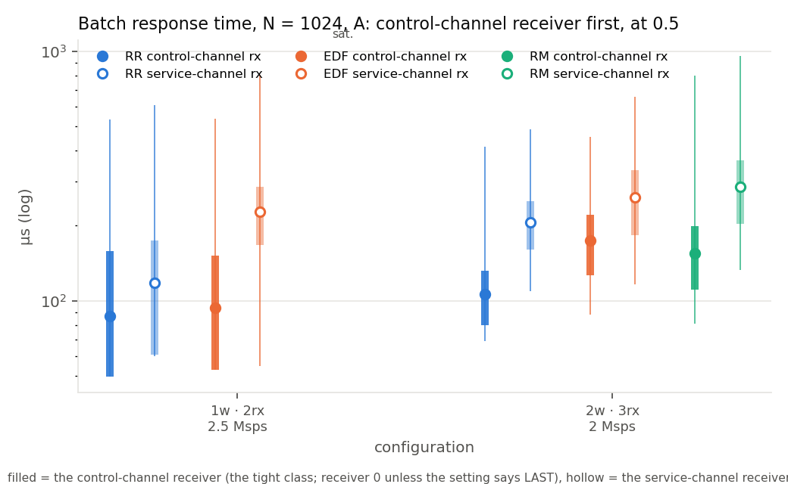
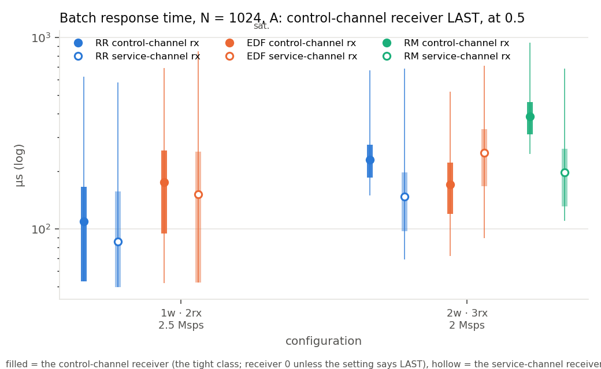
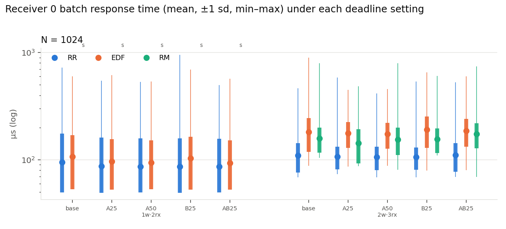

# Experimental evaluation: response time of an 802.11p receiver under RR, EDF and RM in GNU Radio 4, with deadline structure

This document is written as the experimental-results section of a real-time
systems paper would be. It supersedes the equal-deadline evaluation archived in
`archive/RESULTS-equal-deadlines.md` (whose figures remain in this directory
and are referred to below), adds the **deadline-structure experiment** that
gives the scheduler something to order, and **microbenchmarks** that check
the mechanisms the interpretation relies on. Every figure is a range plot:
the dot is the mean, the thick bar spans one sample standard deviation either
side of it, the thin whisker spans the minimum and the maximum, over every
batch (or frame) of every receiver of every repeat. Each figure exists as a
vector PDF beside its PNG; the values are in `numbers.json` files generated
with the figures (`scripts/rt-paper-figs.py`, `scripts/rt-class-figs.py`,
`scripts/rt-microbench4`).

## 1. Experimental setup

**Platform.** A KVM/QEMU guest ("QEMU Virtual CPU version 2.5+", 8 vCPUs,
14 GB, no frequency interface), Linux 7.0, GCC 15, GNU Radio 4 at the
`ieee80211-rx-latency` branch of the fork (the modular-scheduling scheduler
with the lightweight-tracing layer merged). Default kernel scheduling, no
isolation, no real-time priorities, as in the GR3 baseline runs. The host
is not under our control; its noise is discussed in §4.

**Workload.** The IEEE 802.11a/g/p OFDM receiver of `gr-ieee802-11`, ported
block for block to GR4: file source, throttle, arrival stamper, the 14-block
PHY chain (power estimate, autocorrelation, the `sync_short` gate,
`sync_long`, FFT, equaliser, decoder) and a latency sink — 18 blocks per
receiver. The stimulus is a recording of back-to-back 300-byte QPSK 1/2
frames (10 MHz channel), replayed by a throttle at 2.0, 2.5 or 5 Msps. Two
or three receivers share the process in the deadline experiment. Every frame
is checked byte for byte; every run reported here decoded every frame it
replayed.

**Scheduling.** GR4's `Simple<multiThreaded>` scheduler with round robin (RR,
the default sweep), earliest deadline first (EDF, the only policy that tracks
per-block jobs, releases and absolute deadlines) and rate monotonic (RM, a
static order by period), selected as a template argument and otherwise
untouched: no scheduler code was modified for any experiment here. Blocks are
dealt to the *T* workers by index (block *i* to worker *i* mod *T*), so a
policy orders the blocks of one worker; there is no preemption.

**Fixed batching.** The nine blocks between the throttle and the gate take
exactly *N* samples per invocation (*N* = 1024 or 2048); the throttle
publishes whole *N*-sample chunks at their nominal arrival; the gate takes up
to 2*N*; the stream is frame-gated after it.

**Deadline structure (the workload change).** Every block carries an explicit
relative deadline expressed in batch periods *N*/rate, and a period so short
that GR4's release gate never paces it. Three settings, all of them
statements about the receiver rather than about the scheduler:
- *equal* (`base`): every block one batch period — the archived sweep;
- *A, per-channel classes*: an 802.11p station serving the Control Channel
  (safety messages: CAM, DENM, BSM) and Service Channels runs one receiver
  per channel; receiver 0 is the control-channel receiver and its blocks
  before the gate get 0.25 (`A25`) or 0.5 (`A50`) of a batch period, the
  service-channel receivers keep 1;
- *B, frame path*: the deadline-bearing work of any 802.11 receiver is what
  follows detection — `sync_long`, FFT, equaliser, decoder must finish a
  frame promptly; those blocks of every receiver get 0.25 of a batch period
  (`B25`); the front end keeps 1;
- `AB25`: both.
The source and throttle keep a 1 µs deadline (always most urgent). RM is
unchanged by any setting: its ranks come from the (equal, tiny) periods, so
it stays the arbitrary-but-repeatable fixed-priority order of the archived
sweep — by design, so that the comparison isolates what a deadline-driven
policy does with the same information.

**Metrics.** *Batch response time*: nominal arrival of batch *j* to the end
of the `sync_short` invocation that consumed its last sample, from the stream
positions in GR4's `workExact` records. *Frame response time*: release of a
frame's last sample to the decoded packet, from arrival stamps, independent
of the trace. *Demand*: the measured fraction of the busiest worker spent in
`work()` calls that moved samples. *Over-deadline fraction*: batches of a
receiver whose batch response time exceeded that receiver's class deadline.
*EDF miss ratio*: deadline misses over releases of the pipeline blocks. A
configuration is *saturated* when the run exceeded 1.05× its air time or the
throttle published its chunks more than ten batch periods late at the 95th
percentile.

**Method.** The archived sweep (40 configurations × 3 policies × 3 repeats
of 60 s, every trace category live) located the schedulable region and the
knee. The deadline experiment takes eight contention points from it — one,
two and six workers serving two or three receivers at *N* = 1024 and 2048,
at 2.0, 2.5 and 5 Msps — and runs each under the five settings and the three
policies, twice, for 30 s with every trace category live (240 runs). The
microbenchmarks (§2) ran on the idle machine before the sweep. Statistics
come from a 20 s window inside the span the trace rings retained.

## 2. Microbenchmarks: checking the mechanisms

Five targeted measurements, each isolating one quantity the interpretation
of the sweeps rests on (`../micro/MICRO.md`, `../micro/micro.json`).

**M1 — the floor is the pipeline's own cost.** The receiver unthrottled on
one worker under RR with a batch ceiling *N*, `workExact` tracing only, gives
each block's isolated cost per call. The nine blocks of the batch path sum to
42.0 µs at *N* = 1024, 73.4 at 2048 and 97.8 at 4096, of which the gate
alone is 25.6, 44.8 and 59.9 µs. The smallest batch response times the
sweep ever observed were 49, 92 and 174 µs. The gap (7, 19 and 76 µs) is the
throttle's own call, the scheduler's hop from one block to the next, and,
growing with *N*, the gate's wait for its 2*N* window. Per-sample costs are
flat across *N* (19.6 ns per sample for the eight 1:1 blocks together,
30.7 for the gate, 34.9 for `sync_long`, 34.9 for the equaliser, 28.3 to
28.7 for the decoder), so the response-time floor scales linearly with the batch
size, as the sweep's per-*N* panels show.

**M2 — EDF's cost is not arithmetic.** A synthetic graph of Copy blocks
(source, nine copies, sink per chain; 4 KB or 16 KB per call) on one worker
measures the scheduler loop with almost no work inside it. With one chain at
*N* = 1024, RR and EDF cost the same per invocation (958 against 959 ns,
with or without explicit deadlines) and RM 1424 ns, the strict restart of
its sweep after every productive call. With three chains, EDF costs 310 ns
per invocation more than RR (1104 against 794 ns): the selection over
33 blocks' job queues. Every trace category live adds about 465 ns per
invocation under RR and EDF and 930 ns under RM with one chain (620, 465
and 2 640 ns with three). At *N* = 4096 the synthetic
graph is memory-bound and the figure flips between two modes (about 2.0 and
3.8 µs per 16 KB call) according to how far the source runs ahead of its
consumers, which is an artefact of cache locality, not of the policy; the
1024 rows are the measure of the loop's cost. The 4 µs by which EDF's first
block completes later than RR's in the receiver (10 against 6 µs after
arrival), the 8 µs at the gate (75 against 67) and the 22 µs median gap over
the sweep therefore cannot be bookkeeping: they are release-detection
latency — a block runs only once a job has been released for it, and the
release is detected after its producer's call returns — and, with several
receivers per worker, selection among more queues.

**M3 — how long a tight job can be blocked.** Without preemption the worst
wait of a job is one full invocation of whatever is running. The longest
single call M1 recorded is 141 µs at *N* = 1024 (the decoder, a whole
frame), 256 µs at 2048 (a single outlier of `avgcor`; the block's 99th
percentile is 16 µs, so this is the guest, not the block) and 1010 µs at
4096 (a file read of the source). Against those, the class deadline of 0.25
batch period is 102 µs at 2.5 Msps and 51 µs at 5 Msps for *N* = 1024. The
0.25 class is therefore *not* guaranteed even under an ideal non-preemptive
EDF: a control-channel batch that arrives while the decoder is finishing
another receiver's frame will miss. The 0.5 class (205 µs at 2.5 Msps) is
above every routine invocation. This bound is what to read the tight class's
misses against.

**M4 — GR4's EDF does what it says.** Replaying the releases and job starts
of a 30 s capture and asking, at every start, whether a ready job with an
earlier absolute deadline was waiting on the same worker, finds **0
inversions in 2 200 101 job starts** with the class deadlines and 0 in
1 997 271 without. The selection is exact; whatever EDF does or does not
achieve below is a property of the deadlines it was given, not of its
implementation. The same runs also show the limit of deadline scheduling
under overload: both happened to saturate (this point sits at the knee,
§4), and with the control-channel receiver at 0.25 its batch response time
was 2 608 µs against 2 806 and 2 923 µs for the service channels — barely
protected — while its miss ratio was 1.6 % against 0.05 and 0.11 %. Under a
backlog the service channels' jobs have aged: a job released 300 µs ago with
a 410 µs deadline is due before a fresh control-channel job with a 102 µs
one, so EDF serves it first. EDF protects a class by *deadline*, not by
*priority*; once the loose class falls behind, its old jobs outrank the tight
class's new ones. A fixed-priority order would protect the tight class here,
at the price of starving the others.

**M5 — the instrument.** At one receiver, one worker, 2.5 Msps, *N* = 1024,
30 s, with every trace category live against none: the frame response time
moves by +3 µs under RR (304 → 307), +7 under EDF (301 → 309) and +36 under
RM (320 → 356), with the standard deviation unchanged at 180 µs, and the run
time by 0.7 to 1.4 % of air. RM pays most because its restart-after-every-
call loop emits the most records per productive call (M2's traced rows). The
batch response times reported everywhere are traced by construction; the
frame metric bounds the perturbation at a few percent at this load, and
larger in proportion as invocations shorten.

## 3. The deadline-structure experiment (indicative: one repeat)

The full matrix (eight points × five settings × three policies × two
repeats) was cut short at the human's request in favour of quick, indicative
runs: 42 runs of 30 s at two contention points, *N* = 1024 — one worker with
two receivers at 2.5 Msps (demand 0.67) and two workers with three receivers
at 2.0 Msps (busiest worker 0.61) — under the settings of §1 and, in addition,
with the control-channel receiver placed **last** in graph order
(`A25L`, `A50L`). Figures `class_batch_N1024_<setting>.pdf`,
`class_frame_N1024_<setting>.pdf`, `class_summary_batch.pdf`,
`class_over_deadline.pdf`; values in `numbers.json`. Single runs on a KVM
guest: read differences below about 10 µs as noise.

*Figures 12–13. Batch response time with the control-channel receiver
(filled) at 0.5 of a batch period and the service-channel receivers (hollow)
at 1 — first in graph order (top) and last (bottom). `class_summary_batch.pdf`
shows the control-channel receiver under every setting side by side.*

*Figure 14. The control-channel receiver under each deadline setting: EDF
is below RR only in the two-worker `A25L`/`A50L` columns.*

**Batch response time of the control-channel receiver**, mean in µs and the
fraction of its batches later than its own class deadline:

| Point | Tight receiver in graph order | Class deadline | RR | EDF | RM |
|---|---|---|---|---|---|
| 1 worker, 2 receivers, 2.5 Msps | first | 102 µs | 87 (12 %) | 96 (27 %) | saturated |
| 1 worker, 2 receivers, 2.5 Msps | last | 102 µs | 101 (30 %) | 176 (75 %) | saturated |
| 1 worker, 2 receivers, 2.5 Msps | last | 205 µs | 109 (7 %) | 175 (24 %) | saturated |
| 2 workers, 3 receivers, 2.0 Msps | first | 102 µs | 107 (13 %) | 177 (86 %) | 143 (43 %) |
| 2 workers, 3 receivers, 2.0 Msps | last | 102 µs | 239 (100 %) | 195 (90 %) | 350 (100 %) |
| 2 workers, 3 receivers, 2.0 Msps | last | 205 µs | 230 (27 %) | 170 (6 %) | 386 (100 %) |

Under equal deadlines the same two points gave, for receiver 0 and the
others respectively, 95 and 128 µs under RR against 107 and 200 under EDF
(one worker) and 110 and 207 against 182 and 263 (two workers).

**Round robin's list order is a static priority.** Under RR receiver 0's
batches are already served before the others' in every pass (95 against
128 µs at one worker, 110 against 207 at two), because a pass visits the
graph in construction order and the first receiver's blocks come first.
Declaring receiver 0 the control channel therefore changes nothing RR does,
and EDF, which does honour the declaration (its receiver 0 improves from 107
to 96 µs while the service channels move from 200 to 231), still finishes
behind RR. The experiment with the tight receiver *first* measures the
scheduler against an opponent that happens to agree with it.

**With the tight receiver last, EDF is the only policy that protects it on
two workers.** At the 0.5 class (205 µs) EDF serves the control channel in
170 µs with 6 % of its batches late, against 230 µs and 27 % under RR and
386 µs and 100 % under RM; EDF also places it ahead of the service channels
(170 against 249 µs), which RR, bound to its list order, cannot (230 against
147). At the 0.25 class every policy misses most batches — that deadline
(102 µs) is shorter than one decoder invocation (§2, M3), so it is not
meetable without preemption — and EDF still gives the tight receiver the
shortest response (195 against 239 and 350 µs). This is the benefit of
deadline scheduling on this receiver: not lower latency in general, but the
ability to choose *which* receiver's latency is low independently of where
it sits in the graph.

**On one worker EDF loses even for the tight receiver, and the trace says
where.** With the control channel last, EDF's receiver takes 176 µs against
RR's 101. Its per-block completion offsets show the pipeline itself is
served first once its batch is published — 3 µs from publish to the first
block, 81 µs to the gate, against RR's 70 — but the publish comes 95 µs
after the batch's nominal arrival on average (95th percentile 195 µs),
against 31 µs under RR. GR4 releases a source-like block whose producer
rarely runs (the throttle, fed from a full buffer) only at the backstop scan
between passes, and a deadline-ordered pass under load runs up to four
selections per block before returning to it; the arrival of a tight batch
is therefore *detected* late, and no ordering afterwards recovers that.
Round robin's pass is one call per block and returns to the throttle sooner.
The setting that bounds this, `max_selections_per_pass`, was then varied
at the same point (`rx_latency4 --max-selections`, single 30 s runs,
control channel last at 0.5):

| per-pass bound | tight receiver mean | over deadline | throttle lag mean / p95 | service receiver mean |
|---|---|---|---|---|
| GR4 default (4 × blocks = 144) | 174 µs | 24.7 % | 91 / 197 µs | 158 µs |
| 36 (1 × blocks) | 177 µs | 26.1 % | 94 / 199 µs | 159 µs |
| 8 | 140 µs | 9.9 % | 34 / 86 µs | 380 µs |
| 2 | the graph stalls: 4.0× air, three frames decoded | | | |
| RR, for reference | 112 µs | 7.5 % | 41 / 95 µs | 89 µs |

A bound of eight brings the throttle's detection lag down to RR's (34
against 41 µs) and the tight receiver from 174 to 140 µs, at the price of
the service receiver (380 µs: with the loop returning to the backstop every
eight calls, the loose class drains slowly); at two the loop no longer
advances a batch between scans and the graph stops keeping real time. Even
at eight the tight receiver stays 28 µs behind RR's 112, which is the ten
hops' release-and-select latency of the pipeline itself (M2). On two workers
the bound changes nothing (EDF 171 against 174 µs at eight; RR 240) because
there the throttles are on the lightly loaded worker and are detected
promptly anyway. The frame-path setting (B) had no visible effect on either
metric at these points: once a frame is detected its blocks are already
served promptly under every policy.

**RM.** With two receivers on one worker RM saturated the second receiver
in every setting (its batch response time grew to seconds) while serving
the first in about 255 µs: its rank order, a tie-break among equal periods,
put one receiver's blocks below the other's and, without preemption or
ageing, starved them at a total demand of 0.67. With the tight receiver
last on two workers it was the slowest for that receiver in every setting.
Rate-monotonic ranks without informative periods are a fixed priority
assigned by accident, and the experiment shows what that costs.

## 3b. Four workers, four receivers of different rates: the multi-rate experiment

Reported in full in `../multirate/REPORT.md` (figures, tables, threats). In
short: four receivers at 1.25 to 5 Msps on four workers, each receiver's
batch period its implicit deadline, the fastest receiver last in graph order,
construction order rotated so the heavy blocks spread over the workers, RM
with true per-receiver periods. At the scheduler's default
`process_stream_to_message_ratio` of 16 EDF was the worst policy on every
receiver of every mix, by 95 to 250 µs. Microbenchmark M6 (`../micro/MICRO.md`)
found the cause: the house-keeping re-sync every 16 passes rebuilds EDF's
release storage, costing 45 µs per round and 29 % of every EDF worker's time
(and halving its pass rate), against 6.5 µs under RR and RM. With the
ratio at 4096 for all three policies EDF's response times fall by 75 to 170 µs
and the ordering becomes the textbook one: EDF gives the tightest-deadline
receiver fewer late batches than round robin in every mix (8.5 % vs 14.6 %,
5.0 % vs 36.4 %, 15.9 % vs 49.4 %) and charges the loosest-deadline receivers
about 30 µs for it; rate monotonic with true periods is 20 to 50 µs better
still on the fastest receiver but starves the 2.5 Msps receivers at the knee
(21 % late, maxima of 3 and 16 ms) where EDF keeps them at 2 to 5 %. Every
EDF number in §3 and in `../README.md` was measured at ratio 16 and is an
upper bound.

## 4. Threats to validity

- **The platform is a virtual machine.** All timings are from a KVM/QEMU
  guest with 8 vCPUs and no frequency control. The knee is not a fixed
  place: the two-worker, three-receiver, 2.5 Msps EDF point measured 0.77
  demand and 366 µs in the archived sweep and 0.87 demand, saturated, in the
  oracle run minutes later. Configurations above about 0.75 demand of the
  busiest worker should not be compared run to run on this host; the
  deadline experiment was placed at 0.61 and 0.67 for that reason.
- **One repeat.** §3 rests on single 30 s runs. The effects claimed are 40
  to 60 µs (EDF against RR for the tight receiver on two workers) and 75 µs
  (RR against EDF on one worker), against run-to-run variation of about
  10 µs seen between the repeats of the archived sweep at similar points;
  the direction is unlikely to change, the magnitudes may.
- **The instrument.** Every traced run had every category live; M5 bounds
  the effect on the frame metric at 3 to 36 µs at this load and the run
  time at 1.5 %. The batch response times are traced by construction.
- **Windows.** Statistics are over the batches inside the 20 s span the
  rings retained (an idle worker overwrites a 1 GB ring in seconds), not
  over the whole run.
- **Partitioning and no preemption.** GR4 deals blocks to workers by index
  and never interrupts a running block. The one-worker results measure the
  policies' ordering; the two-worker results measure it under a partition
  that puts every receiver's stage-*s* block on the same worker.
- **Deadlines are per block, not end to end.** A class deadline of one
  quarter period applies to each of ten hops separately, and EDF met almost
  all of them (0.001 to 0.02 % misses) while the end-to-end batch response
  time exceeded that same figure most of the time. GR4's release model has
  no end-to-end deadline; a per-stage split of an end-to-end budget was not
  attempted.
- **RM was left with uninformative periods on purpose** in §3, so the three
  policies see the same graph and only EDF uses the added information; §3b
  gives RM its true periods.
- **Every EDF run in §1–§3 used `process_stream_to_message_ratio` 16**,
  whose house-keeping re-sync costs EDF 29 % of each worker (M6,
  §3b). The EDF columns of §3 and of `../README.md` are therefore upper
  bounds; RR and RM are unaffected by the ratio.

## 5. Summary

On this receiver, deadline scheduling buys the ability to decide which
receiver's latency is protected, independently of graph order: with the
control-channel receiver last in the graph and two workers, EDF served it in
170 µs with 6 % of batches past its 205 µs deadline where round robin gave
230 µs and 27 % and rate monotonic 386 µs and 100 %. It does not buy lower
latency in general: EDF's per-invocation cost is negligible (M2) and its
selection exact (M4), but a time-driven source is released only between
passes, so under load the arrival of a tight batch is detected 60 µs later
than round robin sees it; shortening the pass (`max_selections_per_pass`
of eight) recovers most of that on one worker but not all, and costs the
loose class, so on one worker round robin's list order remains the better
static priority. A
class deadline shorter than the longest non-preemptible invocation (M3) is
not meetable by any of the three policies. Rate monotonic with equal periods
is a fixed priority assigned by accident and starves a receiver at two
thirds of a core.

Where the workload has receivers of different rates and the scheduler's
house-keeping cadence is lengthened so that it stops discarding EDF's jobs
(§3b), the picture is the classic one: EDF protects the tightest deadline
better than round robin in every mix and distributes lateness under overload
more evenly than rate monotonic, which is faster still on the highest-rate
receiver but starves the others at the knee.
