# Experimental evaluation: batch response time of an OFDM receiver under RR, EDF and RM in GNU Radio 4

This document is written as the experimental-results section of a real-time
systems paper would be, over the data of the sweep in `..` (decision 0036 of
the GR3 project; procedure in `docs/batch-rt-experiments.md`). Every figure
is a **range plot**: for each configuration and policy the dot is the mean, the
thick bar spans one sample standard deviation either side of it, and the thin
whisker spans the minimum and the maximum, over every batch (or frame) of
every receiver chain of every repeat. Each figure is also provided as a vector
PDF beside its PNG; the numbers are in `numbers.md` and `numbers.json`,
generated by `scripts/rt-paper-figs.py` together with the figures.

## 1. Experimental setup

**Platform.** One x86-64 machine, 8 hardware threads, 14 GB RAM, Linux 7.0,
GCC 15, GNU Radio 4 at the `ieee80211-rx-latency` branch of the fork (the
modular-scheduling scheduler with the lightweight-tracing layer merged). No
CPU isolation, no real-time priorities: the default kernel scheduler, as in
the GR3 baseline runs.

**Workload.** The IEEE 802.11a/g/p OFDM receiver of `gr-ieee802-11`, ported
block for block to GR4 (18 blocks per receiver: file source, throttle,
arrival stamper, the 14-block PHY chain from power estimation through
`sync_short`, `sync_long`, FFT, equaliser and decoder, and a latency sink).
The stimulus is a 60 s recording of back-to-back 300-byte QPSK 1/2 frames
(102 934 frames at 10 Msps), replayed by a throttle at 2.5, 5, 10 or 20 Msps.
One to four independent receivers share the process. Every frame is checked
byte for byte against the transmitted payload; every run reported here
decoded every frame it replayed.

**Scheduling.** GR4's own `Simple<multiThreaded>` scheduler with three
policies selected as a template argument and otherwise untouched: round robin
(RR, the default sweep), earliest deadline first (EDF, the only policy that
tracks per-block jobs, releases and deadlines) and rate monotonic (RM, a
static priority order derived from periods). Workers are 1, 2 or 6 threads;
GR4 deals block *i* of the flattened graph to worker *i* mod *T*, so a policy
orders only the blocks on one worker (partitioned scheduling, no preemption).

**Fixed batching.** Each of the nine blocks between the throttle and the gate
takes exactly *N* samples per invocation (*N* = 1024, 2048, 4096), the
throttle publishes whole *N*-sample chunks at nominal arrival, and every block
carries an explicit relative deadline of one batch period *N*/rate. The gate
(`sync_short`) consumes variable amounts and therefore takes up to 2*N*;
downstream of it the stream is frame-gated and no fixed contract applies.

**Metrics.** *Batch response time*: from the nominal arrival of batch *j*
(throttle start + (*j*+1)·*N*/rate) to the end of the `sync_short` invocation
that consumed the batch's last sample, reconstructed from the stream positions
in GR4's own `workExact` trace records. *Frame response time* (the metric of
the GR3 baseline): from the release of a frame's last sample to the decoded
packet, from arrival stamps and the decoder's output, independent of the
trace. *Demand*: the measured fraction of the busiest worker spent in
`work()` calls that moved samples, from the trace, in the analysis window.
*EDF miss ratio*: deadline misses over releases of the pipeline blocks
(the source and throttle carry a 1 µs deadline by design and are excluded).

**Method.** Three probe runs (one receiver, one worker, RR, 2.5 Msps, one per
*N*) measured per-block costs; from them 40 configurations (workers × receivers
× rate per *N*) were chosen to land near demand targets of 0.3, 0.5, 0.7,
0.85 and 0.95 of the busiest worker, plus a rate sweep. Each configuration ran
60 s under each policy, three times, with **every** trace category live; 27
untraced control runs used the same binary with the mask at zero. A run's
statistics are taken from a 20 s window inside the span its trace rings
retained (rings overwrite; an idle worker emits about 7.6 M records per
second). A configuration counts as **saturated** when the run took more than
1.05× its air time or the throttle published its chunks more than ten batch
periods late at the 95th percentile; the batch response times of a saturated
configuration grow with the run length and are shown separately. 389 runs,
14.4 hours.

## 2. Results

### 2.1 Batch response time at the schedulable configurations

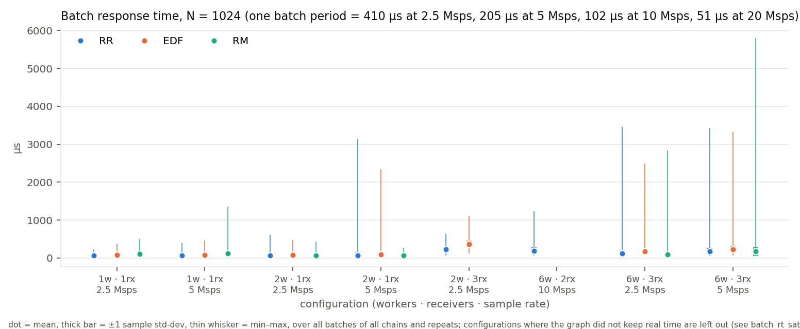
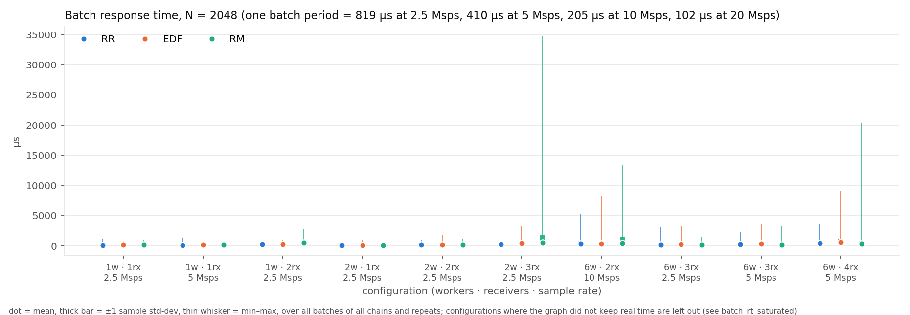
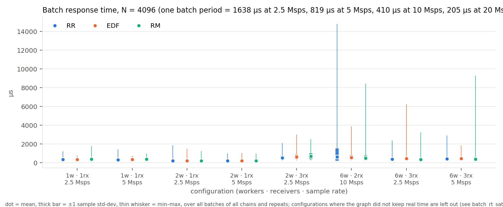
*Figures 1–3 (`batch_rt_N1024.pdf`, `batch_rt_N2048.pdf`, `batch_rt_N4096.pdf`).
Batch response time per configuration, policies side by side; only
configurations where the graph kept real time.*

Across the 24 configurations where all three policies kept real time, **RR and
EDF are close and RM is the one that moves**. At one receiver on
one worker, the point with the least interference, the means at *N* = 1024
are 66 µs (RR), 74 µs (EDF) and 101 µs (RM) at 2.5 Msps and 67, 75 and
117 µs at 5 Msps, with standard deviations of about 30 µs for RR and EDF and
33–49 µs for RM. The floor is the pipeline's own execution time per batch:
the smallest batch response time observed at any unsaturated point is 49 µs
at *N* = 1024, 92 µs at 2048 and 174 µs at 4096, i.e. it scales with *N* as a
fixed per-sample cost would; the RR mean on one worker at 2.5 Msps sits 18,
53 and 164 µs above it at *N* = 1024, 2048 and 4096, so the spread of the
pipeline's own execution grows with *N* as well. Raising the rate from 2.5 to
5 Msps on one worker moves the RR and EDF means by at most 7 µs (RR: 66 → 67,
144 → 143, 338 → 331 µs): at these demands the response time is set by the
work, not by waiting.

EDF's mean exceeds RR's by a median of 22 µs over the 25 configurations where
both kept real time (range −85 to +141 µs). The offset is 3–9 µs on one worker
with one receiver, 19–22 µs on two workers with one receiver, 89–141 µs (and
once 0) where two workers serve two or three receivers, and anywhere from
−85 to +110 µs at six workers. It is the price of release
tracking: under EDF a block runs only after a job has been released for it,
released jobs are ordered by deadline, and with every pre-gate block carrying
the same relative deadline the order among them degenerates to a tie-break
on graph index, so EDF does the same work as RR with extra bookkeeping. The
two configurations where EDF is faster than RR (six workers, two receivers
at 10 Msps, −49 µs at *N* = 2048 and −85 µs at 4096) are the ones with the
highest demand that still kept real time; there RR's maximum is 5.3 and
14.8 ms against EDF's 8.2 and 3.9 ms, so neither policy dominates the tail.

RM is faster than RR in exactly the configurations where the tie-break happens
to favour the pipeline (two workers, one receiver: 66 vs 68 µs at *N* = 1024
and 5 Msps; six workers, three receivers: 95 vs 119 µs) and slower where it
does not (one worker: 101 vs 66 µs). Its ranks among the equal-period blocks
are not a function of rate, so RM behaves here as a fixed-priority scheduler
whose priorities were assigned by an accident of the analysis's iteration
order: consistent from run to run, but not meaningful.

The maxima tell a second story. With one worker and one receiver the maximum
stays under 1.8 ms for every policy (the largest is 1 753 µs, RM at
*N* = 4096); two workers already show a 3.1 ms maximum with a single receiver
(RR, *N* = 1024, 5 Msps); and wherever a worker serves several receivers, or
six workers share the graph, the maxima reach 3–35 ms (RM: 34.7 ms at two
workers and three receivers, 20.4 ms at six workers and four receivers) while
the standard deviation doubles. These tails are not policy effects: they appear equally under all
three, they coincide with the configurations where a worker's block list
mixes several receivers, and the frame metric (§2.5) shows the same tails.
They are the cost of a batch waiting behind another receiver's blocks on the
same worker, which none of the three policies can preempt.

### 2.2 Response time against demand

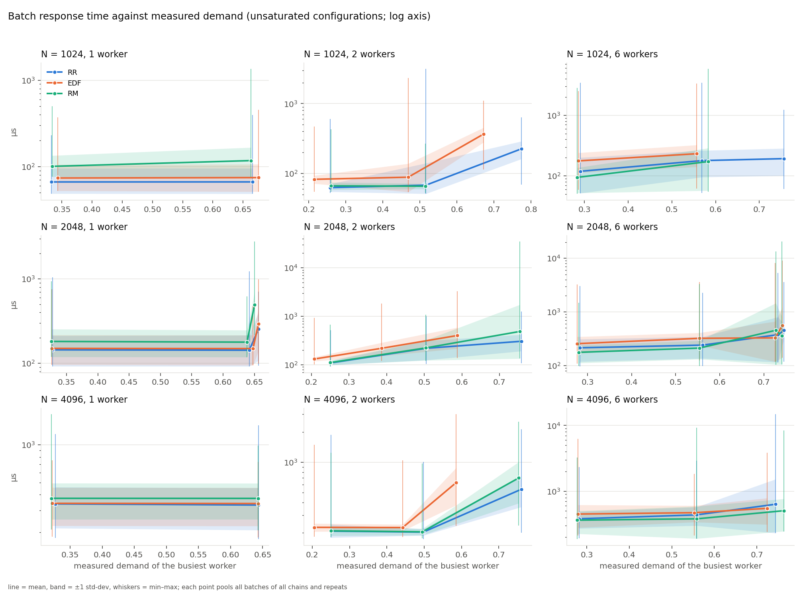
*Figure 4 (`batch_rt_vs_demand.pdf`). Mean (line), ±1 σ (band) and min–max
(whiskers) against the measured demand of the busiest worker, one panel per
(N, workers); log axis.*

With one worker the response time is flat in demand up to 0.67 for every *N*
and every policy: the pipeline is fed by one throttle and each batch is
processed as soon as it arrives. The knee appears with two workers between
demands of 0.5 and 0.75, where the busiest worker starts to carry a backlog:
at *N* = 1024 RR rises from 68 to 225 µs and EDF from 88 to 366 µs between
demands of 0.52 and 0.77, and RM is already saturated at 0.75 (§2.3). With
six workers the RR and EDF means at low demand are 1.8× and 2.4× those of one
worker (119 and 177 µs at *N* = 1024 and 2.5 Msps against 66 and 74 µs) while
RM's is unchanged (95 against 101 µs, its tie-break happening to favour the
pipeline there): the batch now crosses worker
boundaries several times, and each hop is detected one sweep later. Above a
demand of about 0.75 no configuration kept real time under any policy.

### 2.3 Saturation

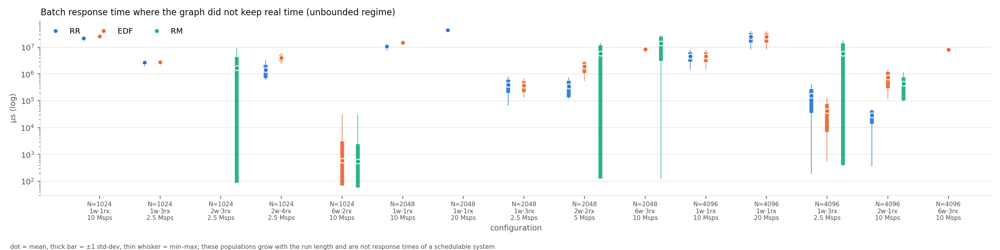
*Figure 5 (`batch_rt_saturated.pdf`). The configurations where the graph did
not keep real time, log axis. These populations are not response times of a
schedulable system: they grow with the run length.*

Sixteen of the 40 configurations saturated under at least one policy. Fourteen
saturated under all three; in every one of those the measured demand of the
busiest worker was 0.87 or more, and the batch response times reach seconds.
The remaining one is the interesting case: **two workers, three receivers at
2.5 Msps, *N* = 1024, demand 0.75, saturated under RM only** (RR 225 µs, EDF
366 µs). RM's static order placed the throttle's readers below the heavy
post-gate blocks of another receiver; once behind, they never caught up, the
throttle's output buffer stayed full, and the batch response time grew to
seconds while the total demand was a quarter below one core. A second
near-miss is six workers, two receivers at 10 Msps, *N* = 1024 (demand 0.76),
where EDF and RM saturated and RR did not. Under a policy that cannot
preempt, a fixed priority order that inverts the dataflow is enough to
starve the head of a pipeline at three quarters of a core.

One receiver at 10 Msps saturates one worker under every policy (measured
demand 0.96–0.97, the ceiling a saturated worker can show): the probes predict
a single receiver's demand at that rate at about 1.37 cores on this machine, so the 10 and 20 Msps single-worker points
of the rate sweep are the unbounded regime by construction.

### 2.4 Deadline misses under EDF

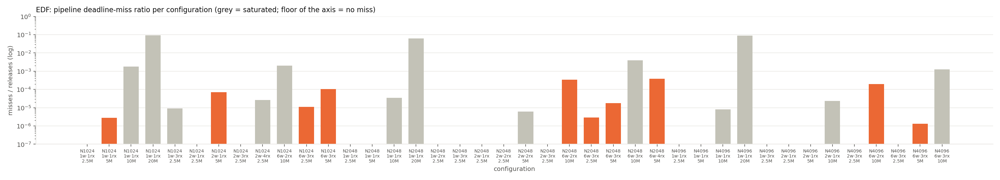
*Figure 6 (`edf_misses.pdf`). EDF pipeline deadline-miss ratio per
configuration, log axis; grey bars are saturated configurations; a bar at
the axis floor is a run without a single miss.*

The deadline is implicit: one batch period after a job's release. Over the
unsaturated configurations EDF released 71.3 million pipeline jobs and missed
7 168 deadlines, a ratio of 1.0 × 10⁻⁴; fifteen of the 25 unsaturated
EDF points recorded no miss at all, and the highest unsaturated ratio is
3.9 × 10⁻⁴ (six workers, four receivers at 5 Msps, *N* = 2048). Saturated
configurations miss at 10⁻² to 10⁻¹ where the backlog is deep (the 20 Msps
single-worker points: 9.2 %, 6.2 %, 9.0 %) but only at 10⁻⁵ to 10⁻³ where
the throttle, not the pipeline, absorbs the backlog. A miss ratio near zero is
therefore not evidence that the system kept up: the throttle's output buffer
is where the overload accumulates, and the jobs that are released still meet
their deadlines once they run. The batch response time, measured from nominal
arrival, is the metric that sees the backlog.

### 2.5 Where a batch's time goes

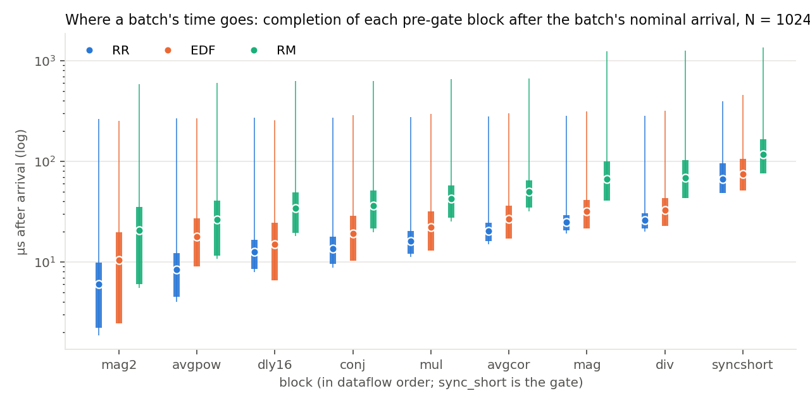
*Figure 7 (`pipeline_N1024.pdf`). Completion of each pre-gate block after the
batch's nominal arrival, one receiver, one worker, 5 Msps, N = 1024; blocks
in dataflow order; log axis. The same figure for N = 2048 and 4096:
`pipeline_N2048.pdf`, `pipeline_N4096.pdf`.*

Under RR the first block completes 6 µs after arrival on average and the gate
at 67 µs; under EDF 10 and 75 µs; under RM 21 and 117 µs. The RM curve is
offset from the first block on: the throttle's readers wait for
higher-ranked blocks before their first invocation. The gap between `div`
(the last 1:1 block) and `sync_short` is 41–48 µs under every policy and is
the gate's own cost on a 1024-sample call (about 30 µs) plus its wait for a
full 2*N* window; the whisker maxima of 397 µs (RR), 455 µs (EDF) and 1.35 ms
(RM) at the gate are single batches that met the house-keeping phase of the
scheduler loop.

### 2.6 The frame metric, and GR3

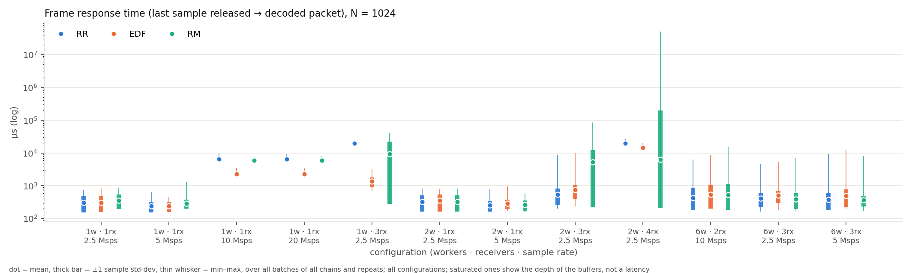
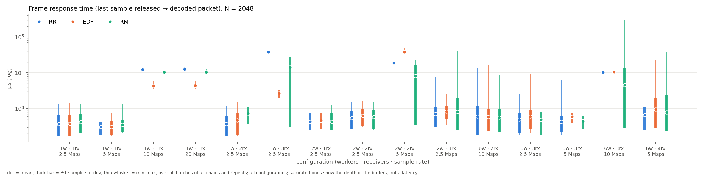
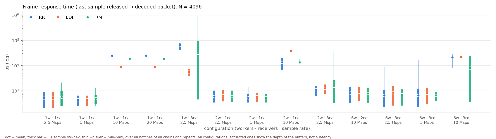
*Figures 8–10 (`frame_rt_N*.pdf`). Frame response time (last sample released
to decoded packet) per configuration, all points, log axis.*

The frame response time adds the frame-gated half of the pipeline
(`sync_long`, FFT, equaliser, decoder) and is measured from the throttle's
actual release, not the nominal arrival. At the schedulable points it tracks
the batch metric plus a near-constant 236–252 µs: 308/310/353 µs (RR/EDF/RM)
against 66/74/101 µs at one receiver, one worker, 2.5 Msps, *N* = 1024. At the
saturated points it does **not** grow without bound: its means range from
0.5 to 65 ms and are bounded by the depth of the edge buffers between
throttle and decoder, because the stamp is taken from a throttle that is
itself late. This is why the batch metric was
defined from nominal arrival: a frame metric anchored at the throttle cannot
distinguish a system that keeps up from one that is a full buffer behind.

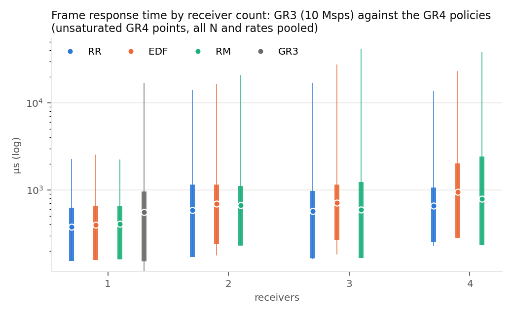
*Figure 11 (`frame_rt_vs_gr3.pdf`). Frame response time by receiver count;
the GR4 policies pooled over all unsaturated points at every N and rate; GR3
is the 60 s single-receiver run at 10 Msps of the baseline project.*

GR3's thread-per-block runtime, on the same graph and machine, has a frame
response time of 555 µs mean, 403 µs standard deviation, 16.8 ms maximum at
one receiver and 10 Msps (its minimum is negative, an artefact of its stamper
running after the decoder for frames decoded within one scheduler turn). The
GR4 means at one receiver are 379–407 µs pooled over every unsaturated rate
and batch size, with maxima of 2.2–2.5 ms: the fixed-batch GR4 pipeline has a
lower mean and a much shorter tail than GR3's, at the price of not keeping
10 Msps on one worker at all, where GR3 spends 2.3 cores.

## 3. Threats to validity

- **The instrument.** Every trace category was live in every traced run
  (0036 item 25); the reference measurements put the cost at 25–50 ns per
  record and a 512-sample invocation emits about ten. At *N* ≥ 1024 the
  invocations are 1–30 µs and the per-record cost is a few percent; the
  controls at 2.5 Msps (smoke sweep) put the frame metric at 303 µs untraced
  against 310 µs traced. The 27 controls of this sweep, however, landed on the
  planner's top-demand point per *N*, which is saturated, so they bound the
  perturbation only in the overload regime (5–13 % of a buffer-depth time).
  An unsaturated control requires a different selection rule in the profile.
- **Windows.** The rings hold the most recent records and a spinning worker
  overwrites them in seconds; the analysis window is the last 20 s the rings
  retained, or less. 344 of the 389 runs lost records; every statistic is
  over the batches inside its window (thousands to tens of thousands), not
  over the full minute. In the first repeat the window of six-worker EDF and
  RM runs fell outside the throttle's retained span and those runs contribute
  only the frame metric; the later repeats carry both.
- **Partitioning.** With 18 blocks per chain and workers dealt by index,
  `sync_short`, `sync_long` and the equaliser of every receiver share one
  worker at *T* = 2. The two-worker results therefore measure a badly
  balanced partition, not the policies at their best; a graph order chosen
  to balance the load would move every two-worker point.
- **RM's priorities.** Every pipeline block has the same derived period, so
  RM's order is a tie-break, repeatable but arbitrary. The RM results
  characterise one fixed-priority assignment, not rate-monotonic scheduling
  with informative periods; explicit periods from the true rates
  (80 → 64 → 48 samples per symbol after the gate) were not assigned.
- **No preemption, partitioned.** GR4's policies choose what runs next on a
  worker and never interrupt a running block; the tails at three receivers
  are blocking, not scheduling, and would need either preemption or a
  partition that keeps a receiver's pipeline on one worker to remove.
- **One machine, one workload.** Absolute times are those of this x86 box
  with the default kernel scheduler and no isolation; the profile for a
  Raspberry Pi 5 exists but has not been run.

## 4. Summary

At the configurations this machine can schedule, the choice among GR4's
round-robin, EDF and rate-monotonic policies moves the mean batch response
time of the receiver by tens of microseconds on a floor of 50–180 µs set by
the pipeline's own cost per batch: EDF costs a median of 22 µs of release
bookkeeping over RR and misses one pipeline deadline in ten thousand; RM, with
priorities that do not follow the dataflow, is the only policy that saturated
a configuration the other two kept (two workers, three receivers, demand
0.75), and it starves the head of the pipeline rather than shedding load. The
tails of 3–6 ms that appear whenever a worker serves several receivers are
blocking under a non-preemptive partitioned scheduler and are identical across
policies. Above a measured demand of about 0.75 of the busiest worker the
system stops keeping real time under every policy, and only a response time
anchored at nominal arrival exposes it; the frame metric, and EDF's own
deadline-miss count, both read as healthy while the backlog sits in the
throttle's buffer.
