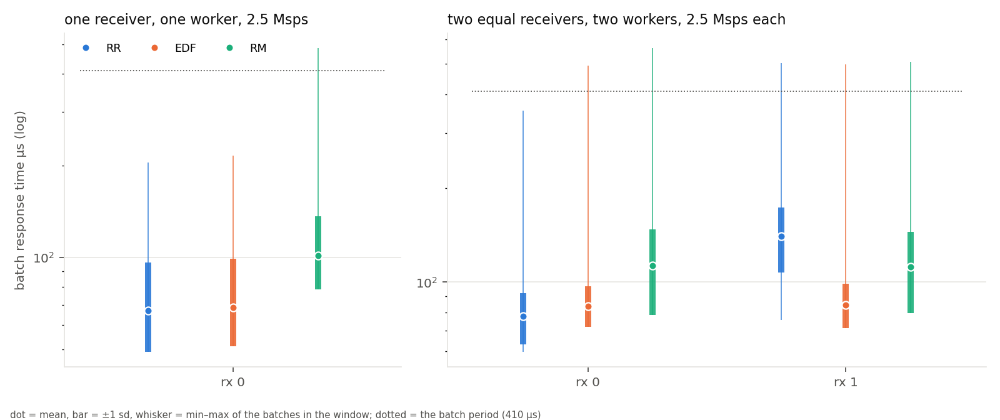
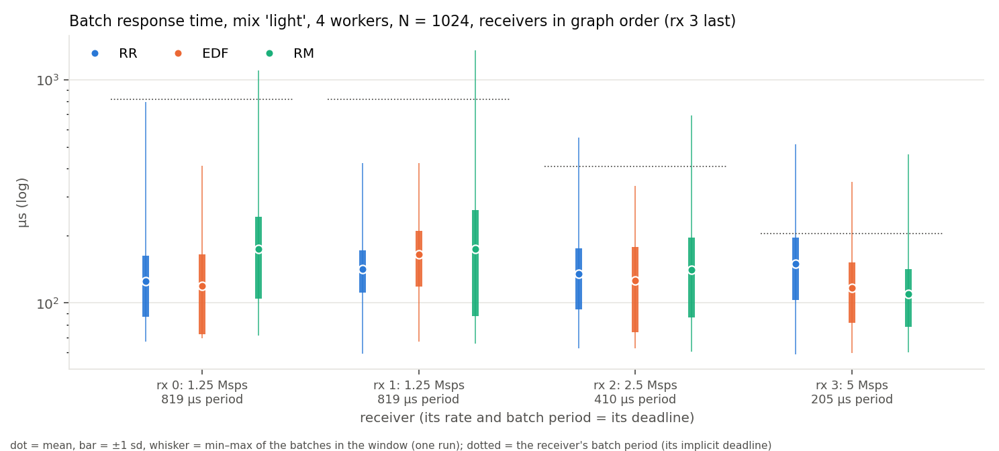
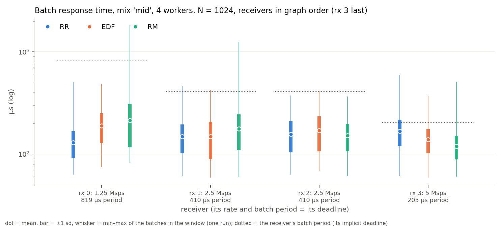
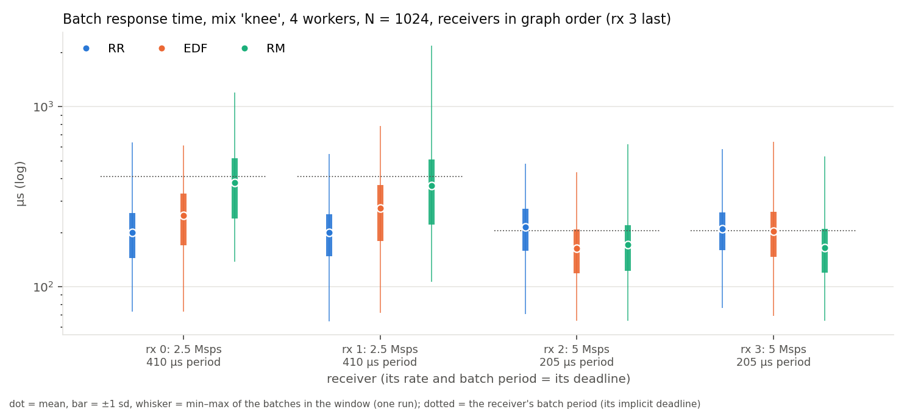
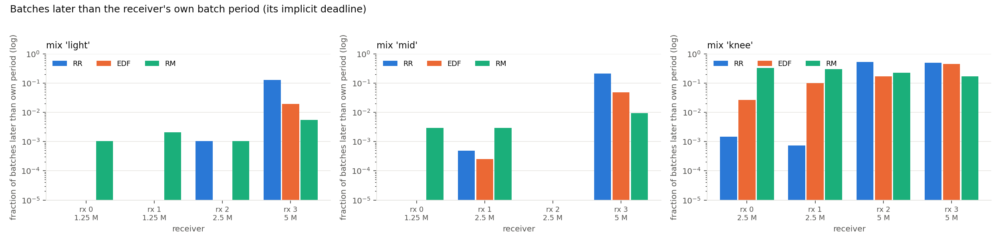
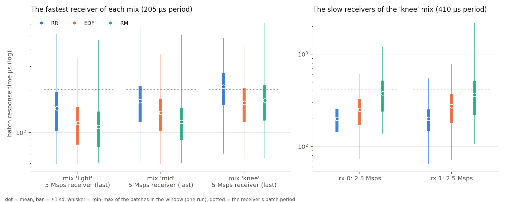

# Which policy for which workload: RR, EDF and RM on the 802.11p receiver (preliminary)

Preliminary results, 2026-09-18. One run per cell, 8 s each, the whole matrix
in about ten minutes (`scripts/rt-prelim4`, figures and every number below
from `scripts/rt-prelim-figs.py`: `numbers.json`, `TABLE.md`). The three
policies are GNU Radio 4's round robin (RR), earliest deadline first (EDF) and
rate monotonic (RM), selected as a template argument; no scheduler code was
changed, and every run uses `process_stream_to_message_ratio` 4096 for every
policy (at the default of 16 EDF pays a 45 µs re-sync every 16 passes, 29 % of a
worker; `../multirate/REPORT.md` §3).

**The three findings, stated up front.**

1. **Round robin is the better policy for a simple workload**, one where EDF has
   nothing to decide: with one receiver, or several receivers of the same rate,
   every job carries the same relative deadline, EDF's order degenerates to
   release order (FIFO), and what remains of EDF is its bookkeeping.
2. **EDF is the better policy where the receivers differ and something must be
   chosen**: when round robin cannot prioritise (its sweep order is the graph
   order, blind to rates and deadlines) and when rate monotonic would starve the
   slow receivers to serve the fast ones.
3. **Rate monotonic is the better policy for the fastest receiver**: a static
   "highest rate first" order serves the tightest deadline with no release
   detection at all, and beats EDF on that receiver in every mix.

## 1. Setup

**Platform.** A KVM/QEMU guest (8 vCPUs, no frequency control), Linux 7.0,
GNU Radio 4 at the `ieee80211-rx-latency` branch of the fork, default kernel
scheduling, no isolation, no real-time priorities.

**Workload.** The IEEE 802.11p receiver of `gr-ieee802-11` ported block for
block (18 blocks per receiver), replaying back-to-back 300-byte QPSK 1/2 frames
through a throttle at the receiver's rate, fixed batches of *N* = 1024 samples,
every block with an explicit relative deadline of one batch period *N*/rate
(its implicit deadline) and every trace category live. Five workloads:

| workload | receivers (Msps, graph order) | workers | what it tests |
|---|---|---|---|
| simple1 | 2.5 | 1 | nothing to prioritise |
| simple2 | 2.5, 2.5 | 2 | equal deadlines across receivers |
| light | 1.25, 1.25, 2.5, 5 | 4 | different rates, ample capacity |
| mid | 1.25, 2.5, 2.5, 5 | 4 | different rates, more load |
| knee | 2.5, 2.5, 5, 5 | 4 | different rates, near the knee |

In the mixes the fastest receiver is last in graph order (round robin serves
it last), construction order is rotated by one slot per receiver so the heavy
blocks spread over the workers, and RM gets the true per-receiver periods
(fastest first). In `simple2` the construction order is rotated too.

**Metric.** Batch response time: from a batch's nominal arrival at the
throttle to its consumption by the `sync_short` gate, from stream positions in
the trace; and the fraction of a receiver's batches later than its own period.
Each mark is the mean (dot), ±1 σ (bar) and min–max (whisker) of the batches
inside the analysis window of the one run. **Windows are short**: the rings
(8 M records per worker) retain the last 0.8 to 1 s of an RR or RM run and 2 to
3 s of an EDF run (an idle RR/RM worker emits records faster), so a cell holds
roughly 1 000 to 15 000 batches; see §5.

## 2. Finding 1 — round robin for the simple workload

| workload | receiver | RR mean / max µs | EDF | RM |
|---|---|---|---|---|
| simple1 | rx 0 | 67 / 205 | 69 / 216 | 101 / 486 |
| simple2 | rx 0 | 78 / 354 | 84 / 495 | 113 / 562 |
| simple2 | rx 1 | 140 / 503 | 85 / 497 | 112 / 507 |

**One receiver.** With one receiver every job has the same relative deadline
and EDF's order is release order: it is round robin with bookkeeping. The
measurement shows exactly that: RR 67 µs mean, EDF 69, with EDF's maximum
11 µs higher; nothing is late under either. What EDF pays for is measured
elsewhere: per invocation its bookkeeping is equal to RR's on one chain and
40 % more on three (M2, `../micro/MICRO.md`: 958 vs 958 ns, 1104 vs 796 ns at
*N* = 1024), and per pass its release scan takes 14 to 28 % of a worker's time
that RR spends probing instead (M6). RM is 34 µs slower here because with one
receiver its static order is the tie-break among equal periods, not a rate
order.

**Two equal receivers.** The same relative deadlines again, so EDF is FIFO
across the two receivers, and the figure shows what that buys and costs: EDF
serves both receivers alike (84 and 85 µs), round robin serves the first in
78 µs and the second in 140 µs, because its sweep order is the graph order and
the second receiver's blocks come after the first's on every worker. So "the
simple workload where RR wins" is the one receiver, or receivers whose order in
the graph does not matter; as soon as two equal receivers are compared with
each other, EDF's FIFO is fairer and cheaper in total (an average of 84 against
109 µs) than RR's fixed order. Nothing is late under any policy in either
workload; the differences are tens of µs against a 410 µs period.

## 3. Finding 2 — EDF where receivers differ and something must be chosen

Batch response time mean / max µs and the share of batches later than the
receiver's own period:

| mix | receiver (Msps, period µs) | RR | EDF | RM |
|---|---|---|---|---|
| light | rx 3 (5, 205) | 150 / 516 (12.7 %) | **117 / 348 (2.0 %)** | 110 / 464 (0.5 %) |
| light | rx 2 (2.5, 410) | 135 / 551 (0.1 %) | 126 / 335 (0.0 %) | 141 / 694 (0.1 %) |
| light | rx 0, rx 1 (1.25, 819) | 125, 142 | 119, 165 | 174, 174 |
| mid | rx 3 (5, 205) | 168 / 592 (21.2 %) | **139 / 369 (4.8 %)** | 120 / 510 (0.9 %) |
| mid | rx 1, rx 2 (2.5, 410) | 148, 157 | 148, 170 | 177, 152 |
| mid | rx 0 (1.25, 819) | 129 | 190 | 213 |
| knee | rx 2 (5, 205) | 214 / 483 (52.9 %) | **163 / 431 (17.2 %)** | 170 / 619 (22.3 %) |
| knee | rx 3 (5, 205) | 209 / 581 (49.8 %) | 203 / 640 (45.5 %) | 164 / 528 (17.0 %) |
| knee | rx 0, rx 1 (2.5, 410) | 200, 200 (0.1, 0.1 %) | **249, 273 (2.6, 9.8 %)** | 379, 365 (33.0, 29.9 %) |

**Where round robin cannot prioritise.** RR's sweep is the graph order: the
5 Msps receiver, last in the graph, is served last on every worker whatever
its deadline says, and it is the only receiver that is ever late under RR:
12.7 %, 21.2 % and about 50 % of its batches miss its 205 µs period in the
three mixes, while the slow receivers are never late. EDF reads the deadlines
and moves the lateness to where it belongs: the 5 Msps receiver's late share
falls to 2.0 %, 4.8 % and 17.2 % (rx 2 at the knee), its mean by 30 to 50 µs
and its maximum by 50 to 220 µs, and the receivers with the 819 µs deadlines
pay up to 60 µs that they can afford (one of them is even served 6 µs
sooner). At the knee, where the graph is near the
capacity of four workers, RR has both 5 Msps receivers late half the time;
EDF holds one of them at 17 % and the other where RR had it.

**Where rate monotonic would starve the slow receivers.** RM's static order
serves the 5 Msps receivers first always. In the light and mid mixes that
costs the slow receivers up to 85 µs and nothing is late. At the knee it
starves them: 33 % and 30 % of the 2.5 Msps receivers' batches miss their
410 µs period under RM, with maxima of 1.2 and 2.2 ms, against 2.6 % and 9.8 %
under EDF (maxima 0.6 and 0.8 ms). EDF also beats RM on one of the two fast
receivers at the knee (163 against 170 µs, 17.2 % against 22.3 % late). So
under load EDF is the policy that keeps every receiver's lateness bounded by
its own deadline as far as the graph allows, where RR cannot see the deadlines
and RM sacrifices the slow receivers to the fast ones.

**EDF's own accounting** agrees: it missed 0 of its per-job pipeline deadlines
in every run but the knee, where it missed 1.

## 4. Finding 3 — rate monotonic for the fastest receiver

| mix | 5 Msps receiver (last), RR | EDF | RM |
|---|---|---|---|
| light | 150 µs, 12.7 % late | 117 µs, 2.0 % | **110 µs, 0.5 %** |
| mid | 168 µs, 21.2 % | 139 µs, 4.8 % | **120 µs, 0.9 %** |
| knee | 209 µs, 49.8 % | 203 µs, 45.5 % | **164 µs, 17.0 %** |

On the fastest receiver of every mix RM is the best policy: 7 to 40 µs better
than EDF in the mean and three to five times fewer late batches. A static
"highest rate first" order needs no release detection: the moment a worker
looks for work it takes the 5 Msps receiver's block if it has input, while
EDF admits a time-driven source only at its per-pass release scan and a
cross-worker successor only at the next pass of the other worker, so a tight
job is seen tens of µs later than RM acts on it. The price is the right-hand
panel: at the knee RM's slow receivers are the worst of any policy (379 and
365 µs mean, 30 % late, 2.2 ms maximum). RM is the policy for a system whose
only requirement is the fastest receiver's latency and whose slow receivers
may wait.

## 5. Threats to validity

- **Preliminary: one run per cell, 8 s each, windows of 0.8 to 2.4 s.** The
  rings retain the last 0.8 to 1.1 s of an RR or RM run and 1.5 to 2.4 s of an
  EDF run, so a cell holds 1 000 to 11 000 batches. In the three-repeat, 30 s
  version of the mixes (`../multirate/REPORT.md`) the same cells moved by 10 to
  20 µs of mean between repeats; differences of that size here (RR against EDF
  on the 2.5 Msps receivers of the mid mix, EDF against RM on rx 2 at the knee)
  are not established. The directions of the three findings agree with that
  longer experiment.
- **Virtual machine.** A KVM/QEMU guest; the knee mix sits where this host's
  capacity varies run to run (measured demand of the busiest worker 0.56 to
  0.57 here). Maxima carry host noise.
- **Ratio 4096 for all.** At the scheduler's default house-keeping ratio of
  16 EDF loses every one of these comparisons (`../multirate/REPORT.md` §2.1,
  §3); the ratio was raised for all three policies and does not change RR or
  RM.
- **The instrument.** Every category traced; the trace costs a few percent of
  run time (M5) and idle RR/RM workers emit records fastest, hence their shorter
  windows.
- **Partitioned, non-preemptive.** Blocks are dealt to workers by index and a
  running block is never interrupted; a policy orders one worker's share. The
  construction order was rotated so that the receivers' heavy blocks spread
  over the workers; without that, two-worker and four-worker runs put every
  receiver's gate on the same worker.
- **Deadlines are per block and implicit.** "Late" means the end-to-end batch
  path exceeded the receiver's own period; EDF was given per-block deadlines of
  that same length and met them.

## 6. Files

- `prelim_simple`, `prelim_mix_light|mid|knee`, `prelim_late`, `prelim_fast_slow`
  (PDF + PNG), `numbers.json`, `TABLE.md` — this directory.
- Runs: `data/rt_300_300_102934_QPSK_1_2_s1/runs4/prelim-x86-8core/<workload>_<policy>/`
  (`batch_rt.json`, `batch_rt.csv`, `latency_summary.json`, `trace_meta.json`; not tracked), `index.json`.
- Reproduce (about ten minutes): `./scripts/rt-prelim4 --out-dir <runs dir>` then
  `./scripts/rt-prelim-figs.py <runs dir> --out-dir results/sweep-<name>/prelim`.
